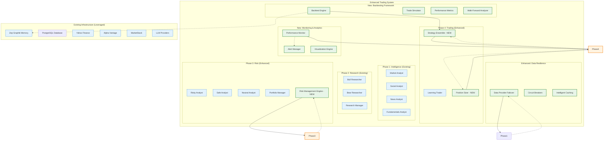

# Design Document

## Overview

The Trading System Enhancement design builds upon the existing sophisticated TradingAgents framework to complete critical missing components identified in the implementation gap analysis. The design leverages the current 12-agent architecture, Zep Graphiti memory system, and multi-provider data infrastructure while adding backtesting capabilities, completing risk management functions, enhancing strategy systems, and implementing robust fallback mechanisms.

The enhancement follows a modular approach that integrates seamlessly with existing components while maintaining the current 4-phase workflow: Intelligence → Research → Risk → Trading. All new components are designed to be production-ready with comprehensive testing, monitoring, and error handling.

## Architecture

### System Architecture Overview



### Integration Points

The enhancement integrates with existing systems at these key points:

1. **Agent Workflow Integration**: New components plug into the existing 4-phase LangGraph workflow
2. **Memory System Integration**: Graph-based data uses existing Zep Graphiti, structured data uses PostgreSQL
3. **Data Provider Integration**: Enhanced failover leverages existing Yahoo Finance, Alpha Vantage, MarketStack
4. **Configuration Integration**: New components use existing TradingAgentsConfig and environment setup
5. **Logging Integration**: All components use existing Winston-based structured logging
6. **Database Integration**: PostgreSQL provides relational storage for performance metrics, backtesting results, and time-series data

## Components and Interfaces

### 1. Backtesting Framework

#### BacktestEngine
```typescript
interface BacktestEngine {
  // Core backtesting functionality
  runBacktest(config: BacktestConfig): Promise<BacktestResult>;
  validateStrategy(strategy: ITradingStrategy): Promise<ValidationResult>;
  
  // Integration with existing systems
  loadHistoricalData(symbol: string, dateRange: DateRange): Promise<MarketData[]>;
  executeStrategy(strategy: ITradingStrategy, data: MarketData[]): Promise<Trade[]>;
}

interface BacktestConfig {
  strategy: ITradingStrategy;
  symbols: string[];
  startDate: Date;
  endDate: Date;
  initialCapital: number;
  commission: number;
  slippage: number;
  marketImpact: boolean;
}

interface BacktestResult {
  trades: Trade[];
  performance: PerformanceMetrics;
  equity: EquityCurve;
  drawdowns: DrawdownAnalysis;
  riskMetrics: RiskAnalysis;
}
```

#### TradeSimulator
```typescript
interface TradeSimulator {
  // Realistic trade execution simulation
  simulateTrade(order: Order, marketData: MarketData): Promise<ExecutedTrade>;
  applySlippage(price: number, volume: number): number;
  calculateCommission(trade: Trade): number;
  simulateMarketImpact(order: Order, marketData: MarketData): number;
  
  // Market hours and constraints
  isMarketOpen(timestamp: Date): boolean;
  queueOrder(order: Order): void;
  processQueuedOrders(marketData: MarketData): Promise<ExecutedTrade[]>;
}
```

#### WalkForwardAnalyzer
```typescript
interface WalkForwardAnalyzer {
  // Overfitting detection and parameter optimization
  performWalkForward(config: WalkForwardConfig): Promise<WalkForwardResult>;
  optimizeParameters(strategy: ITradingStrategy, data: MarketData[]): Promise<OptimizedParameters>;
  detectOverfitting(inSample: PerformanceMetrics, outOfSample: PerformanceMetrics): OverfittingAnalysis;
  
  // Parameter stability analysis
  analyzeParameterStability(results: WalkForwardResult[]): ParameterStabilityReport;
}
```

### 2. Enhanced Risk Management

#### RiskManagementEngine
```typescript
interface RiskManagementEngine {
  // Replace placeholder functions with real implementations
  assessTechnicalIndicatorRisk(symbol: string, indicators: TechnicalIndicators): Promise<RiskAssessment>;
  calculateQuantitativeRisk(symbol: string, fundamentals: FundamentalData): Promise<QuantitativeRisk>;
  evaluateSectorSentiment(symbol: string, sector: string): Promise<SectorSentiment>;
  analyzeVolatility(symbol: string, priceHistory: PriceData[]): Promise<VolatilityAnalysis>;
  
  // Advanced risk calculations
  calculateVaR(portfolio: Portfolio, confidence: number): Promise<number>;
  calculateCVaR(portfolio: Portfolio, confidence: number): Promise<number>;
  performMonteCarloSimulation(portfolio: Portfolio, scenarios: number): Promise<SimulationResult>;
}

interface TechnicalIndicatorRisk {
  rsiExtremeZones: boolean;
  macdDivergence: boolean;
  bollingerSqueeze: boolean;
  overallRiskScore: number;
  riskFactors: string[];
}

interface QuantitativeRisk {
  valueAtRisk: number;
  conditionalVaR: number;
  sharpeRatio: number;
  sortinoRatio: number;
  maxDrawdown: number;
  riskScore: number;
}

interface VolatilityAnalysis {
  historicalVolatility: number;
  garchVolatility: number;
  volatilityClustering: boolean;
  archTestResult: ArchTestResult;
  volatilityRegime: 'low' | 'medium' | 'high';
}
```

### 3. Strategy Enhancement System

#### StrategyEnsemble
```typescript
interface StrategyEnsemble {
  // Multi-strategy signal aggregation
  aggregateSignals(signals: TradingSignal[]): Promise<AggregatedSignal>;
  resolveConflicts(conflictingSignals: TradingSignal[]): Promise<TradingSignal>;
  updateWeights(performanceData: StrategyPerformance[]): Promise<void>;
  
  // Ensemble management
  addStrategy(strategy: ITradingStrategy, weight: number): void;
  removeStrategy(strategyId: string): void;
  rebalanceWeights(performanceWindow: number): Promise<WeightUpdate[]>;
}

interface AggregatedSignal extends TradingSignal {
  contributingStrategies: string[];
  confidenceWeights: Record<string, number>;
  consensusStrength: number;
  conflictResolution?: ConflictResolution;
}

interface ConflictResolution {
  method: 'correlation_analysis' | 'performance_weighting' | 'confidence_voting';
  resolution: TradingSignal;
  reasoning: string;
}
```

#### PositionSizer
```typescript
interface PositionSizer {
  // Position sizing algorithms
  calculateKellySize(signal: TradingSignal, portfolio: Portfolio): Promise<PositionSize>;
  calculateRiskParitySize(portfolio: Portfolio, newPosition: Position): Promise<PositionSize>;
  calculateVolatilityAdjustedSize(signal: TradingSignal, volatility: number): Promise<PositionSize>;
  
  // Portfolio-level constraints
  enforceRiskLimits(proposedPosition: Position, portfolio: Portfolio): Promise<Position>;
  calculateCorrelationAdjustment(newPosition: Position, portfolio: Portfolio): Promise<number>;
}

interface PositionSize {
  shares: number;
  dollarAmount: number;
  portfolioPercentage: number;
  riskAdjustment: number;
  reasoning: string;
}
```

#### DynamicParameterOptimizer
```typescript
interface DynamicParameterOptimizer {
  // Market regime detection and parameter adaptation
  detectMarketRegime(marketData: MarketData[]): Promise<MarketRegime>;
  optimizeForRegime(strategy: ITradingStrategy, regime: MarketRegime): Promise<OptimizedParameters>;
  adaptParameters(strategy: ITradingStrategy, performanceData: PerformanceMetrics[]): Promise<ParameterUpdate>;
  
  // Performance-based optimization
  trackParameterPerformance(parameters: StrategyParameters, performance: PerformanceMetrics): void;
  suggestParameterAdjustments(strategy: ITradingStrategy): Promise<ParameterSuggestion[]>;
}
```

### 4. Data Provider Resilience

#### DataProviderFailover
```typescript
interface DataProviderFailover {
  // Multi-provider failover management
  getMarketData(symbol: string, providers: DataProvider[]): Promise<MarketData>;
  getNewsData(symbol: string, providers: NewsProvider[]): Promise<NewsData[]>;
  getSocialSentiment(symbol: string, providers: SocialProvider[]): Promise<SentimentData>;
  
  // Health monitoring and circuit breakers
  checkProviderHealth(provider: DataProvider): Promise<HealthStatus>;
  enableCircuitBreaker(provider: DataProvider, threshold: number): void;
  handleProviderFailure(provider: DataProvider, fallbackProviders: DataProvider[]): Promise<void>;
}

interface HealthStatus {
  provider: string;
  status: 'healthy' | 'degraded' | 'failed';
  responseTime: number;
  errorRate: number;
  lastCheck: Date;
}

interface CircuitBreakerConfig {
  failureThreshold: number;
  recoveryTimeout: number;
  halfOpenRequests: number;
}
```

#### IntelligentCaching
```typescript
interface IntelligentCaching {
  // Multi-level caching strategy
  cacheMarketData(symbol: string, data: MarketData, ttl: number): Promise<void>;
  getCachedData(symbol: string, maxAge: number): Promise<MarketData | null>;
  invalidateCache(symbol: string, reason: string): Promise<void>;
  
  // Cache optimization
  prefetchData(symbols: string[], priority: 'high' | 'medium' | 'low'): Promise<void>;
  optimizeCacheSize(maxMemory: number): Promise<CacheOptimizationResult>;
  getCacheStatistics(): Promise<CacheStatistics>;
}
```

### 5. Performance Analytics and Monitoring

#### PerformanceMonitor
```typescript
interface PerformanceMonitor {
  // Real-time performance tracking
  trackStrategyPerformance(strategyId: string, performance: PerformanceMetrics): Promise<void>;
  calculateRollingMetrics(strategyId: string, window: number): Promise<RollingMetrics>;
  compareStrategies(strategyIds: string[], timeframe: TimeFrame): Promise<StrategyComparison>;
  
  // Anomaly detection
  detectPerformanceAnomalies(performance: PerformanceMetrics[]): Promise<Anomaly[]>;
  generatePerformanceAlerts(thresholds: AlertThresholds): Promise<Alert[]>;
}

#### DatabaseManager
```typescript
import { Pool, PoolClient } from 'pg';

interface DatabaseManager {
  // Connection management with async support
  initializeConnections(): Promise<void>;
  getPostgreSQLPool(): Pool;
  executeQuery<T>(query: string, params?: any[]): Promise<T[]>;
  executeTransaction<T>(queries: TransactionQuery[]): Promise<T>;
  
  // Multi-database storage management
  storeGraphData(data: GraphData): Promise<void>; // Uses Zep Graphiti/Neo4j
  storeStructuredData(data: StructuredData): Promise<void>; // Uses PostgreSQL
  storeTimeSeriesData(data: TimeSeriesData): Promise<void>; // Uses PostgreSQL
  
  // Query optimization with connection pooling
  queryPerformanceMetrics(query: MetricsQuery): Promise<PerformanceData[]>;
  queryBacktestResults(query: BacktestQuery): Promise<BacktestResult[]>;
  queryTimeSeriesData(query: TimeSeriesQuery): Promise<TimeSeriesData[]>;
  
  // Connection health and cleanup
  checkConnectionHealth(): Promise<DatabaseHealthStatus>;
  closeConnections(): Promise<void>;
}

interface TransactionQuery {
  query: string;
  params?: any[];
}

interface DatabaseHealthStatus {
  postgresql: {
    connected: boolean;
    activeConnections: number;
    idleConnections: number;
    totalConnections: number;
    lastError?: string;
  };
  zepGraphiti: {
    connected: boolean;
    lastPing?: Date;
    lastError?: string;
  };
}

#### AgentMemoryManager
```typescript
import { Pool } from 'pg';

interface AgentMemoryManager {
  // Async initialization with connection pooling
  initialize(pool: Pool): Promise<void>;
  
  // Episodic Memory - Conversation history and interaction logs
  storeEpisodicMemory(memory: EpisodicMemory): Promise<void>;
  retrieveEpisodicMemory(query: EpisodicQuery): Promise<EpisodicMemory[]>;
  batchStoreEpisodicMemory(memories: EpisodicMemory[]): Promise<void>;
  
  // Semantic Memory - Long-term facts and knowledge with embeddings
  storeSemanticMemory(memory: SemanticMemory): Promise<void>;
  retrieveSemanticMemory(query: SemanticQuery): Promise<SemanticMemory[]>;
  searchSemanticSimilarity(embedding: number[], threshold: number): Promise<SemanticMemory[]>;
  batchUpdateEmbeddings(updates: SemanticEmbeddingUpdate[]): Promise<void>;
  
  // Working Memory - Active context with TTL expiration
  storeWorkingMemory(memory: WorkingMemory, ttl: number): Promise<void>;
  retrieveWorkingMemory(sessionId: string): Promise<WorkingMemory[]>;
  expireWorkingMemory(sessionId: string): Promise<void>;
  cleanupExpiredMemory(): Promise<number>; // Returns count of cleaned records
  
  // Procedural Memory - Learned patterns and preferences
  storeProceduralMemory(memory: ProceduralMemory): Promise<void>;
  retrieveProceduralMemory(query: ProceduralQuery): Promise<ProceduralMemory[]>;
  updateUserPreferences(userId: string, preferences: UserPreferences): Promise<void>;
  incrementPatternFrequency(patternId: string): Promise<void>;
  
  // Batch operations for performance
  executeBatchOperations(operations: BatchMemoryOperation[]): Promise<BatchResult>;
}

interface BatchMemoryOperation {
  type: 'insert' | 'update' | 'delete';
  table: 'episodic_memory' | 'semantic_memory' | 'working_memory' | 'procedural_memory';
  data: any;
}

interface BatchResult {
  successful: number;
  failed: number;
  errors: string[];
}

interface SemanticEmbeddingUpdate {
  id: string;
  embedding: number[];
}

interface EpisodicMemory {
  id: string;
  sessionId: string;
  userId: string;
  agentId: string;
  timestamp: Date;
  interactionType: 'analysis_request' | 'strategy_execution' | 'risk_assessment' | 'user_feedback';
  context: Record<string, any>; // JSONB for flexible schema
  input: string;
  output: string;
  metadata: {
    marketConditions?: MarketCondition;
    performanceMetrics?: PerformanceMetrics;
    confidence?: number;
    executionTime?: number;
  };
}

interface SemanticMemory {
  id: string;
  factType: 'market_knowledge' | 'strategy_rule' | 'risk_principle' | 'user_insight';
  content: string;
  embedding: number[]; // Vector embedding for similarity search
  confidence: number;
  source: string;
  createdAt: Date;
  updatedAt: Date;
  tags: string[];
  relatedEntities: string[]; // Stock symbols, strategy names, etc.
}

interface WorkingMemory {
  id: string;
  sessionId: string;
  agentId: string;
  contextType: 'active_analysis' | 'pending_decision' | 'recent_interaction';
  data: Record<string, any>; // JSONB for flexible context
  priority: number;
  expiresAt: Date;
  createdAt: Date;
}

interface ProceduralMemory {
  id: string;
  userId: string;
  patternType: 'trading_preference' | 'risk_tolerance' | 'analysis_style' | 'notification_preference';
  pattern: Record<string, any>; // JSONB for flexible rules
  frequency: number; // How often this pattern has been observed
  confidence: number;
  lastUsed: Date;
  createdAt: Date;
  updatedAt: Date;
}

interface RollingMetrics {
  returns: RollingWindow<number>;
  sharpeRatio: RollingWindow<number>;
  maxDrawdown: RollingWindow<number>;
  winRate: RollingWindow<number>;
  volatility: RollingWindow<number>;
}

interface StrategyComparison {
  strategies: string[];
  relativePerformance: Record<string, number>;
  correlationMatrix: number[][];
  statisticalSignificance: Record<string, number>;
  rankingByMetric: Record<string, string[]>;
}
```

#### AlertManager
```typescript
interface AlertManager {
  // Configurable alerting system
  createAlert(config: AlertConfig): Promise<string>;
  updateAlert(alertId: string, config: Partial<AlertConfig>): Promise<void>;
  deleteAlert(alertId: string): Promise<void>;
  
  // Alert processing
  checkAlerts(currentMetrics: SystemMetrics): Promise<TriggeredAlert[]>;
  sendAlert(alert: TriggeredAlert, channels: NotificationChannel[]): Promise<void>;
  acknowledgeAlert(alertId: string, userId: string): Promise<void>;
}

interface AlertConfig {
  name: string;
  condition: AlertCondition;
  threshold: number;
  timeframe: number;
  channels: NotificationChannel[];
  severity: 'low' | 'medium' | 'high' | 'critical';
}
```

## Data Models

### Core Trading Models (Enhanced)

```typescript
// Enhanced existing models with new fields
interface EnhancedTradingSignal extends TradingSignal {
  ensembleWeight?: number;
  contributingStrategies?: string[];
  riskAdjustment?: number;
  positionSizeRecommendation?: PositionSize;
}

interface EnhancedPortfolio extends Portfolio {
  riskMetrics: PortfolioRiskMetrics;
  correlationMatrix: CorrelationMatrix;
  rebalanceHistory: RebalanceEvent[];
  performanceAttribution: PerformanceAttribution;
}

interface BacktestTrade extends Trade {
  slippage: number;
  commission: number;
  marketImpact: number;
  executionDelay: number;
  marketConditions: MarketCondition;
}
```

### Performance and Risk Models

```typescript
interface PerformanceMetrics {
  totalReturn: number;
  annualizedReturn: number;
  volatility: number;
  sharpeRatio: number;
  sortinoRatio: number;
  calmarRatio: number;
  maxDrawdown: number;
  winRate: number;
  profitFactor: number;
  averageWin: number;
  averageLoss: number;
  largestWin: number;
  largestLoss: number;
}

interface RiskMetrics {
  valueAtRisk95: number;
  valueAtRisk99: number;
  conditionalVaR95: number;
  conditionalVaR99: number;
  beta: number;
  alpha: number;
  trackingError: number;
  informationRatio: number;
}

interface DrawdownAnalysis {
  maxDrawdown: number;
  maxDrawdownDuration: number;
  currentDrawdown: number;
  drawdownPeriods: DrawdownPeriod[];
  recoveryTimes: number[];
  averageRecoveryTime: number;
}
```

### Configuration Models

```typescript
interface EnhancedTradingConfig extends TradingAgentsConfig {
  backtesting: BacktestingConfig;
  riskManagement: RiskManagementConfig;
  strategyEnsemble: EnsembleConfig;
  dataResilience: ResilienceConfig;
  monitoring: MonitoringConfig;
  database: DatabaseConfig;
}

interface DatabaseConfig {
  postgresql: {
    host: string;
    port: number;
    database: string;
    username: string;
    password: string;
    ssl: boolean;
    poolSize: number;
    connectionTimeoutMillis: number;
    idleTimeoutMillis: number;
    maxUses: number;
    allowExitOnIdle: boolean;
  };
  zepGraphiti: {
    apiKey: string;
    baseUrl: string;
    sessionId?: string;
    userId?: string;
  };
  storageStrategy: {
    performanceMetrics: 'postgresql' | 'both';
    backtestResults: 'postgresql' | 'both';
    timeSeriesData: 'postgresql';
    graphRelationships: 'zep_graphiti';
    agentMemory: 'zep_graphiti' | 'postgresql' | 'both';
    episodicMemory: 'postgresql';
    semanticMemory: 'postgresql';
    workingMemory: 'postgresql';
    proceduralMemory: 'postgresql';
  };
  pgvector: {
    enabled: boolean;
    embeddingDimensions: number;
    similarityThreshold: number;
  };
}

interface BacktestingConfig {
  defaultCommission: number;
  defaultSlippage: number;
  enableMarketImpact: boolean;
  maxLookbackPeriod: number;
  walkForwardSteps: number;
  optimizationMetric: 'sharpe' | 'return' | 'calmar';
}

interface RiskManagementConfig {
  maxPositionSize: number;
  maxPortfolioRisk: number;
  varConfidence: number;
  rebalanceThreshold: number;
  correlationThreshold: number;
}
```

## Error Handling

### Comprehensive Error Management

The system implements a multi-layered error handling approach:

#### 1. Data Provider Error Handling
```typescript
class DataProviderError extends Error {
  constructor(
    public provider: string,
    public errorType: 'timeout' | 'rate_limit' | 'invalid_response' | 'network',
    message: string
  ) {
    super(message);
  }
}

// Automatic failover with exponential backoff
async function getDataWithFailover<T>(
  providers: DataProvider[],
  operation: (provider: DataProvider) => Promise<T>
): Promise<T> {
  let lastError: Error;
  
  for (const provider of providers) {
    try {
      return await operation(provider);
    } catch (error) {
      lastError = error;
      logger.warn(`Provider ${provider.name} failed, trying next`, { error });
    }
  }
  
  throw new DataProviderError('all', 'network', `All providers failed: ${lastError.message}`);
}
```

#### 2. Backtesting Error Handling
```typescript
class BacktestError extends Error {
  constructor(
    public phase: 'data_loading' | 'strategy_execution' | 'performance_calculation',
    public symbol?: string,
    message?: string
  ) {
    super(message);
  }
}

// Graceful degradation for missing data
async function handleMissingData(symbol: string, dateRange: DateRange): Promise<MarketData[]> {
  try {
    return await loadHistoricalData(symbol, dateRange);
  } catch (error) {
    logger.warn(`Missing data for ${symbol}, using interpolation`, { error });
    return await interpolateMissingData(symbol, dateRange);
  }
}
```

#### 3. Strategy Ensemble Error Handling
```typescript
class EnsembleError extends Error {
  constructor(
    public strategyId: string,
    public errorType: 'signal_generation' | 'weight_calculation' | 'conflict_resolution',
    message: string
  ) {
    super(message);
  }
}

// Robust signal aggregation with fallbacks
async function aggregateSignalsWithFallback(strategies: ITradingStrategy[]): Promise<AggregatedSignal> {
  const signals: TradingSignal[] = [];
  const failedStrategies: string[] = [];
  
  for (const strategy of strategies) {
    try {
      const signal = await strategy.generateSignal();
      signals.push(signal);
    } catch (error) {
      failedStrategies.push(strategy.id);
      logger.error(`Strategy ${strategy.id} failed to generate signal`, { error });
    }
  }
  
  if (signals.length === 0) {
    throw new EnsembleError('ensemble', 'signal_generation', 'All strategies failed');
  }
  
  return await aggregateSignals(signals, failedStrategies);
}
```

## Testing Strategy

### Comprehensive Testing Framework

#### 1. Unit Testing
```typescript
// Risk management function tests
describe('RiskManagementEngine', () => {
  test('should calculate VaR correctly', async () => {
    const engine = new RiskManagementEngine();
    const portfolio = createTestPortfolio();
    const var95 = await engine.calculateVaR(portfolio, 0.95);
    expect(var95).toBeGreaterThan(0);
    expect(var95).toBeLessThan(portfolio.totalValue * 0.1);
  });
  
  test('should detect volatility clustering', async () => {
    const engine = new RiskManagementEngine();
    const priceData = generateVolatileTimeSeries();
    const analysis = await engine.analyzeVolatility('TEST', priceData);
    expect(analysis.volatilityClustering).toBe(true);
  });
});

// Strategy ensemble tests
describe('StrategyEnsemble', () => {
  test('should resolve conflicting signals', async () => {
    const ensemble = new StrategyEnsemble();
    const conflictingSignals = [
      { type: 'BUY', strength: 0.8, strategy: 'momentum' },
      { type: 'SELL', strength: 0.6, strategy: 'mean_reversion' }
    ];
    const resolved = await ensemble.resolveConflicts(conflictingSignals);
    expect(resolved.type).toBeDefined();
    expect(resolved.conflictResolution).toBeDefined();
  });
});
```

#### 2. Integration Testing
```typescript
// Backtesting integration tests
describe('BacktestEngine Integration', () => {
  test('should complete full backtest workflow', async () => {
    const engine = new BacktestEngine();
    const config = createBacktestConfig();
    const result = await engine.runBacktest(config);
    
    expect(result.trades.length).toBeGreaterThan(0);
    expect(result.performance.totalReturn).toBeDefined();
    expect(result.equity.length).toBeGreaterThan(0);
  });
  
  test('should handle data provider failures gracefully', async () => {
    const engine = new BacktestEngine();
    // Simulate provider failure
    mockDataProvider.mockImplementation(() => { throw new Error('Provider down'); });
    
    const config = createBacktestConfig();
    const result = await engine.runBacktest(config);
    
    // Should still complete with fallback data
    expect(result).toBeDefined();
    expect(result.warnings).toContain('Used fallback data provider');
  });
});
```

#### 3. Performance Testing
```typescript
// High-frequency backtesting performance
describe('Performance Tests', () => {
  test('should handle large datasets efficiently', async () => {
    const engine = new BacktestEngine();
    const largeDataset = generateLargeMarketDataset(100000); // 100k data points
    
    const startTime = Date.now();
    const result = await engine.runBacktest({
      strategy: new TestStrategy(),
      data: largeDataset
    });
    const duration = Date.now() - startTime;
    
    expect(duration).toBeLessThan(30000); // Should complete in under 30 seconds
    expect(result.trades.length).toBeGreaterThan(0);
  });
});
```

#### 4. End-to-End Testing
```typescript
// Complete workflow testing
describe('End-to-End Trading Workflow', () => {
  test('should execute complete 12-agent analysis with enhancements', async () => {
    const graph = new EnhancedTradingGraph(config);
    const result = await graph.executeWorkflow('AAPL');
    
    // Verify all phases completed
    expect(result.phase1.marketAnalysis).toBeDefined();
    expect(result.phase2.researchSynthesis).toBeDefined();
    expect(result.phase3.riskAssessment).toBeDefined();
    expect(result.phase4.tradingDecision).toBeDefined();
    
    // Verify enhancements are integrated
    expect(result.phase3.enhancedRiskMetrics).toBeDefined();
    expect(result.phase4.ensembleSignal).toBeDefined();
    expect(result.phase4.positionSize).toBeDefined();
  });
});
```

## PostgreSQL Schema Design

### Agent Memory Tables

```sql
-- Episodic Memory: Conversation history and interaction logs
CREATE TABLE episodic_memory (
    id UUID PRIMARY KEY DEFAULT gen_random_uuid(),
    session_id VARCHAR(255) NOT NULL,
    user_id VARCHAR(255) NOT NULL,
    agent_id VARCHAR(255) NOT NULL,
    timestamp TIMESTAMPTZ NOT NULL DEFAULT NOW(),
    interaction_type VARCHAR(50) NOT NULL,
    context JSONB NOT NULL,
    input TEXT NOT NULL,
    output TEXT NOT NULL,
    metadata JSONB DEFAULT '{}',
    created_at TIMESTAMPTZ NOT NULL DEFAULT NOW()
);

-- Indexes for efficient querying
CREATE INDEX idx_episodic_session_timestamp ON episodic_memory(session_id, timestamp DESC);
CREATE INDEX idx_episodic_user_agent ON episodic_memory(user_id, agent_id);
CREATE INDEX idx_episodic_interaction_type ON episodic_memory(interaction_type);
CREATE INDEX idx_episodic_context_gin ON episodic_memory USING GIN(context);

-- Semantic Memory: Long-term facts and knowledge with embeddings
CREATE EXTENSION IF NOT EXISTS vector;

CREATE TABLE semantic_memory (
    id UUID PRIMARY KEY DEFAULT gen_random_uuid(),
    fact_type VARCHAR(50) NOT NULL,
    content TEXT NOT NULL,
    embedding vector(1536), -- OpenAI embedding dimensions
    confidence DECIMAL(3,2) NOT NULL,
    source VARCHAR(255) NOT NULL,
    tags TEXT[] DEFAULT '{}',
    related_entities TEXT[] DEFAULT '{}',
    created_at TIMESTAMPTZ NOT NULL DEFAULT NOW(),
    updated_at TIMESTAMPTZ NOT NULL DEFAULT NOW()
);

-- Vector similarity index for embedding search
CREATE INDEX idx_semantic_embedding ON semantic_memory USING ivfflat (embedding vector_cosine_ops);
CREATE INDEX idx_semantic_fact_type ON semantic_memory(fact_type);
CREATE INDEX idx_semantic_tags_gin ON semantic_memory USING GIN(tags);
CREATE INDEX idx_semantic_entities_gin ON semantic_memory USING GIN(related_entities);

-- Working Memory: Active context with TTL expiration
CREATE TABLE working_memory (
    id UUID PRIMARY KEY DEFAULT gen_random_uuid(),
    session_id VARCHAR(255) NOT NULL,
    agent_id VARCHAR(255) NOT NULL,
    context_type VARCHAR(50) NOT NULL,
    data JSONB NOT NULL,
    priority INTEGER DEFAULT 0,
    expires_at TIMESTAMPTZ NOT NULL,
    created_at TIMESTAMPTZ NOT NULL DEFAULT NOW()
);

-- Indexes and automatic cleanup
CREATE INDEX idx_working_session_agent ON working_memory(session_id, agent_id);
CREATE INDEX idx_working_expires_at ON working_memory(expires_at);
CREATE INDEX idx_working_priority ON working_memory(priority DESC);

-- Automatic cleanup of expired working memory
CREATE OR REPLACE FUNCTION cleanup_expired_working_memory()
RETURNS void AS $$
BEGIN
    DELETE FROM working_memory WHERE expires_at < NOW();
END;
$$ LANGUAGE plpgsql;

-- Procedural Memory: Learned patterns and preferences
CREATE TABLE procedural_memory (
    id UUID PRIMARY KEY DEFAULT gen_random_uuid(),
    user_id VARCHAR(255) NOT NULL,
    pattern_type VARCHAR(50) NOT NULL,
    pattern JSONB NOT NULL,
    frequency INTEGER DEFAULT 1,
    confidence DECIMAL(3,2) NOT NULL,
    last_used TIMESTAMPTZ NOT NULL DEFAULT NOW(),
    created_at TIMESTAMPTZ NOT NULL DEFAULT NOW(),
    updated_at TIMESTAMPTZ NOT NULL DEFAULT NOW()
);

-- Indexes for efficient pattern retrieval
CREATE INDEX idx_procedural_user_type ON procedural_memory(user_id, pattern_type);
CREATE INDEX idx_procedural_frequency ON procedural_memory(frequency DESC);
CREATE INDEX idx_procedural_confidence ON procedural_memory(confidence DESC);
CREATE INDEX idx_procedural_pattern_gin ON procedural_memory USING GIN(pattern);

-- Performance and Analytics Tables
CREATE TABLE strategy_performance (
    id UUID PRIMARY KEY DEFAULT gen_random_uuid(),
    strategy_id VARCHAR(255) NOT NULL,
    timestamp TIMESTAMPTZ NOT NULL DEFAULT NOW(),
    symbol VARCHAR(20) NOT NULL,
    performance_metrics JSONB NOT NULL,
    market_conditions JSONB DEFAULT '{}',
    created_at TIMESTAMPTZ NOT NULL DEFAULT NOW()
);

CREATE INDEX idx_strategy_perf_id_timestamp ON strategy_performance(strategy_id, timestamp DESC);
CREATE INDEX idx_strategy_perf_symbol ON strategy_performance(symbol);

CREATE TABLE backtest_results (
    id UUID PRIMARY KEY DEFAULT gen_random_uuid(),
    strategy_id VARCHAR(255) NOT NULL,
    config JSONB NOT NULL,
    results JSONB NOT NULL,
    start_date DATE NOT NULL,
    end_date DATE NOT NULL,
    created_at TIMESTAMPTZ NOT NULL DEFAULT NOW()
);

CREATE INDEX idx_backtest_strategy ON backtest_results(strategy_id);
CREATE INDEX idx_backtest_dates ON backtest_results(start_date, end_date);
```

### Key Queries for Agent Memory

```sql
-- Retrieve recent episodic memories for context
SELECT * FROM episodic_memory 
WHERE session_id = $1 AND agent_id = $2 
ORDER BY timestamp DESC 
LIMIT 10;

-- Semantic similarity search using pgvector
SELECT content, confidence, 1 - (embedding <=> $1) as similarity
FROM semantic_memory 
WHERE fact_type = $2 
ORDER BY embedding <=> $1 
LIMIT 5;

-- Get active working memory for session
SELECT * FROM working_memory 
WHERE session_id = $1 AND expires_at > NOW() 
ORDER BY priority DESC, created_at ASC;

-- Find user patterns by type
SELECT pattern, frequency, confidence 
FROM procedural_memory 
WHERE user_id = $1 AND pattern_type = $2 
ORDER BY frequency DESC, confidence DESC;

-- Performance analytics with time windows
SELECT 
    strategy_id,
    AVG((performance_metrics->>'sharpe_ratio')::numeric) as avg_sharpe,
    AVG((performance_metrics->>'total_return')::numeric) as avg_return
FROM strategy_performance 
WHERE timestamp >= NOW() - INTERVAL '30 days'
GROUP BY strategy_id;
```

### Async PostgreSQL Implementation Example

```typescript
import { Pool, PoolClient } from 'pg';
import { createLogger } from '../utils/enhanced-logger';

const logger = createLogger('database', 'DatabaseManager');

export class DatabaseManager {
  private pgPool: Pool;
  private isInitialized = false;

  constructor(private config: DatabaseConfig) {}

  async initializeConnections(): Promise<void> {
    try {
      // Initialize PostgreSQL connection pool with async support
      this.pgPool = new Pool({
        host: this.config.postgresql.host,
        port: this.config.postgresql.port,
        database: this.config.postgresql.database,
        user: this.config.postgresql.username,
        password: this.config.postgresql.password,
        ssl: this.config.postgresql.ssl,
        max: this.config.postgresql.poolSize,
        connectionTimeoutMillis: this.config.postgresql.connectionTimeoutMillis,
        idleTimeoutMillis: this.config.postgresql.idleTimeoutMillis,
        maxUses: this.config.postgresql.maxUses,
        allowExitOnIdle: this.config.postgresql.allowExitOnIdle
      });

      // Test connection
      const client = await this.pgPool.connect();
      await client.query('SELECT NOW()');
      client.release();

      this.isInitialized = true;
      logger.info('Database connections initialized successfully');
    } catch (error) {
      logger.error('Failed to initialize database connections', { error });
      throw error;
    }
  }

  async executeQuery<T>(query: string, params?: any[]): Promise<T[]> {
    if (!this.isInitialized) {
      throw new Error('Database not initialized');
    }

    const client = await this.pgPool.connect();
    try {
      const result = await client.query(query, params);
      return result.rows as T[];
    } catch (error) {
      logger.error('Query execution failed', { query, params, error });
      throw error;
    } finally {
      client.release();
    }
  }

  async executeTransaction<T>(queries: TransactionQuery[]): Promise<T> {
    const client = await this.pgPool.connect();
    try {
      await client.query('BEGIN');
      
      const results = [];
      for (const { query, params } of queries) {
        const result = await client.query(query, params);
        results.push(result.rows);
      }
      
      await client.query('COMMIT');
      return results as T;
    } catch (error) {
      await client.query('ROLLBACK');
      logger.error('Transaction failed', { error });
      throw error;
    } finally {
      client.release();
    }
  }

  async checkConnectionHealth(): Promise<DatabaseHealthStatus> {
    const status: DatabaseHealthStatus = {
      postgresql: {
        connected: false,
        activeConnections: 0,
        idleConnections: 0,
        totalConnections: 0
      },
      zepGraphiti: {
        connected: false
      }
    };

    try {
      // Check PostgreSQL health
      const client = await this.pgPool.connect();
      await client.query('SELECT 1');
      client.release();

      status.postgresql.connected = true;
      status.postgresql.totalConnections = this.pgPool.totalCount;
      status.postgresql.idleConnections = this.pgPool.idleCount;
      status.postgresql.activeConnections = this.pgPool.totalCount - this.pgPool.idleCount;
    } catch (error) {
      status.postgresql.lastError = error.message;
    }

    return status;
  }

  async closeConnections(): Promise<void> {
    if (this.pgPool) {
      await this.pgPool.end();
      logger.info('Database connections closed');
    }
  }
}

export class AgentMemoryManager {
  private pool: Pool;

  async initialize(pool: Pool): Promise<void> {
    this.pool = pool;
  }

  async storeEpisodicMemory(memory: EpisodicMemory): Promise<void> {
    const query = `
      INSERT INTO episodic_memory (
        session_id, user_id, agent_id, timestamp, interaction_type,
        context, input, output, metadata
      ) VALUES ($1, $2, $3, $4, $5, $6, $7, $8, $9)
    `;
    
    const params = [
      memory.sessionId,
      memory.userId,
      memory.agentId,
      memory.timestamp,
      memory.interactionType,
      JSON.stringify(memory.context),
      memory.input,
      memory.output,
      JSON.stringify(memory.metadata)
    ];

    const client = await this.pool.connect();
    try {
      await client.query(query, params);
    } finally {
      client.release();
    }
  }

  async searchSemanticSimilarity(
    embedding: number[], 
    threshold: number
  ): Promise<SemanticMemory[]> {
    const query = `
      SELECT *, 1 - (embedding <=> $1) as similarity
      FROM semantic_memory 
      WHERE 1 - (embedding <=> $1) > $2
      ORDER BY embedding <=> $1
      LIMIT 10
    `;

    const client = await this.pool.connect();
    try {
      const result = await client.query(query, [JSON.stringify(embedding), threshold]);
      return result.rows.map(row => ({
        ...row,
        embedding: JSON.parse(row.embedding),
        tags: row.tags || [],
        relatedEntities: row.related_entities || []
      }));
    } finally {
      client.release();
    }
  }

  async batchStoreEpisodicMemory(memories: EpisodicMemory[]): Promise<void> {
    const client = await this.pool.connect();
    try {
      await client.query('BEGIN');
      
      for (const memory of memories) {
        await this.storeEpisodicMemory(memory);
      }
      
      await client.query('COMMIT');
    } catch (error) {
      await client.query('ROLLBACK');
      throw error;
    } finally {
      client.release();
    }
  }

  async cleanupExpiredMemory(): Promise<number> {
    const query = 'DELETE FROM working_memory WHERE expires_at < NOW()';
    
    const client = await this.pool.connect();
    try {
      const result = await client.query(query);
      return result.rowCount || 0;
    } finally {
      client.release();
    }
  }
}
```

### Package Dependencies

```json
{
  "dependencies": {
    "pg": "^8.11.3",
    "pgvector": "^0.1.8"
  },
  "devDependencies": {
    "@types/pg": "^8.10.7"
  }
}
```

The testing strategy ensures comprehensive coverage of all new components while validating integration with existing systems. Tests are designed to run in CI/CD pipelines and provide clear feedback on system reliability and performance.