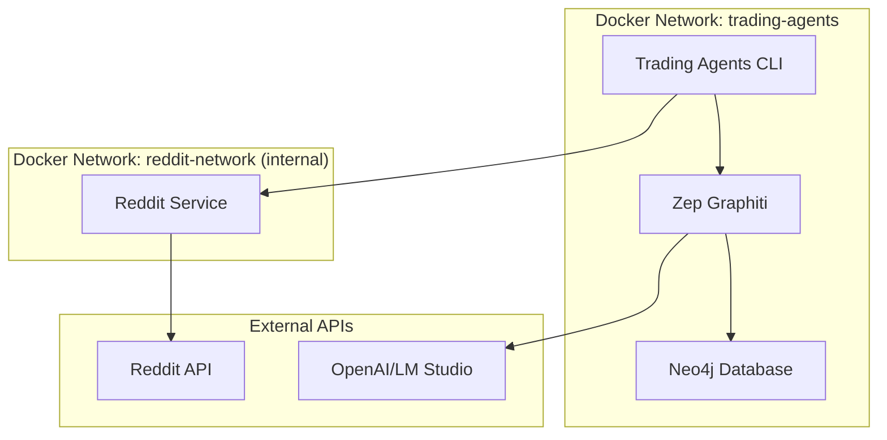

# Trading Agents - Unified Docker Setup

This directory contains the unified Docker Compose configuration that consolidates all Trading Agents services into a single, easy-to-manage setup.

## 🏗️ Architecture Overview

The unified docker-compose.yml orchestrates four main services:



### Services

| Service | Port | Purpose | Dependencies |
|---------|------|---------|--------------|
| **neo4j** | 7474, 7687 | Knowledge graph database | None |
| **zep-graphiti** | 8000 | Memory & learning service | neo4j |
| **reddit-service** | 3001 | Social sentiment analysis | None |
| **trading-agents** | - | Main application | All others |

## 🚀 Quick Start

### Prerequisites

1. **Docker Desktop** installed and running
2. **Environment files** configured (see Configuration section)

### Start All Services

**Windows (PowerShell):**
```powershell
.\start-all-services.ps1
```

**Linux/macOS:**
```bash
chmod +x start-all-services.sh
./start-all-services.sh
```

**Manual Docker Compose:**
```bash
docker compose up
```

### Advanced Options

**Rebuild containers:**
```bash
# PowerShell
.\start-all-services.ps1 -Build

# Bash
./start-all-services.sh --build
```

**Clean start (removes all data):**
```bash
# PowerShell
.\start-all-services.ps1 -Fresh

# Bash
./start-all-services.sh --fresh
```

**Background mode:**
```bash
# PowerShell
.\start-all-services.ps1 -Detached

# Bash
./start-all-services.sh --detached
```

**Start specific services:**
```bash
# PowerShell
.\start-all-services.ps1 -Services neo4j,zep-graphiti

# Bash
./start-all-services.sh --services "neo4j,zep-graphiti"
```

## ⚙️ Configuration

### Required Environment Files

Create these files with your API keys and configuration:

#### `.env.local` (Project Root)
```bash
# Main application configuration
NODE_ENV=production
LOG_LEVEL=info

# Neo4j Configuration
NEO4J_USER=neo4j
NEO4J_PASSWORD=your_secure_password_here

# LM Studio Configuration
LM_STUDIO_URL=http://your-lm-studio-server:1234
OPENAI_API_KEY=your_openai_key_or_lm_studio_key

# Reddit Integration
REDDIT_ENABLED=true
REDDIT_SERVICE_URL=http://reddit-service:3001
```

#### `py_zep/.env.local` (Zep Graphiti Service)
```bash
# OpenAI/LM Studio Configuration
OPENAI_API_KEY=your_openai_key_or_lm_studio_key
OPENAI_BASE_URL=http://your-lm-studio-server:1234/v1

# Embedding Configuration
EMBEDDING_MODEL=text-embedding-3-small
EMBEDDING_PROVIDER=openai

# Neo4j Connection (configured automatically)
NEO4J_URI=bolt://trading-agents-neo4j:7687
NEO4J_USER=neo4j
NEO4J_PASSWORD=your_secure_password_here
```

#### `services/reddit-service/.env.local` (Reddit Service)
```bash
# Reddit API Configuration
REDDIT_CLIENT_ID=your_reddit_client_id
REDDIT_CLIENT_SECRET=your_reddit_client_secret
REDDIT_USER_AGENT=TradingAgents:v1.0.0 (by /u/your_username)

# Optional: Reddit OAuth
REDDIT_REFRESH_TOKEN=your_refresh_token
REDDIT_USERNAME=your_username
REDDIT_PASSWORD=your_password

# Service Configuration
PORT=3001
NODE_ENV=production
LOG_LEVEL=info
```

### Optional: Docker Secrets

For production deployments, you can use Docker secrets instead of environment files:

```bash
# Create secret files
echo "your_openai_key" > py_zep/secrets/openai_api_key.txt
echo "your_embedding_key" > py_zep/secrets/embedder_api_key.txt
echo "neo4j" > py_zep/secrets/neo4j_user.txt
echo "your_password" > py_zep/secrets/neo4j_password.txt
echo "http://your-lm-studio:1234" > py_zep/secrets/lm_studio_url.txt
```

## 📊 Service Management

### View Service Status
```bash
docker compose ps
```

### View Logs
```bash
# All services
docker compose logs -f

# Specific service
docker compose logs -f neo4j
docker compose logs -f zep-graphiti
docker compose logs -f reddit-service
docker compose logs -f trading-agents
```

### Restart Services
```bash
# Restart specific service
docker compose restart zep-graphiti

# Restart all services
docker compose restart
```

### Stop Services
```bash
# Stop all services
docker compose down

# Stop and remove volumes (WARNING: deletes data)
docker compose down -v
```

### Scale Services (if needed)
```bash
# Scale Reddit service for high load
docker compose up --scale reddit-service=3
```

## 🌐 Service URLs

Once all services are running:

| Service | URL | Purpose |
|---------|-----|---------|
| Neo4j Browser | http://localhost:7474 | Database management |
| Zep Graphiti API | http://localhost:8000 | Memory service API |
| Reddit Service | http://localhost:3001 | Sentiment analysis API |
| Reddit Service Health | http://localhost:3001/health | Health check |

### API Documentation

- **Zep Graphiti**: http://localhost:8000/docs (Swagger UI)
- **Reddit Service**: http://localhost:3001/docs (when implemented)

## 🔧 Troubleshooting

### Common Issues

**Services not starting:**
```bash
# Check Docker is running
docker --version

# Check for port conflicts
netstat -an | findstr "7474\|7687\|8000\|3001"

# Check logs for errors
docker compose logs
```

**Memory service connection issues:**
```bash
# Verify Neo4j is healthy
docker compose ps neo4j

# Check Zep Graphiti logs
docker compose logs zep-graphiti

# Test Neo4j connection
docker compose exec neo4j cypher-shell -u neo4j -p your_password "RETURN 1"
```

**Reddit service authentication:**
```bash
# Check Reddit service environment
docker compose exec reddit-service env | grep REDDIT

# Test Reddit service health
curl http://localhost:3001/health
```

### Performance Tuning

**Increase memory limits:**
```yaml
# In docker-compose.yml, adjust resource limits:
deploy:
  resources:
    limits:
      memory: 2G  # Increase from 1G
      cpus: '2.0'  # Increase from 1.0
```

**Neo4j performance:**
```bash
# Add to neo4j environment in docker-compose.yml:
- NEO4J_dbms_memory_heap_initial_size=1G
- NEO4J_dbms_memory_heap_max_size=2G
- NEO4J_dbms_memory_pagecache_size=1G
```

## 📝 Development

### Local Development Mode

For development, you can run services individually:

```bash
# Start only infrastructure services
docker compose up neo4j zep-graphiti reddit-service

# Run trading agents locally
cd js
npm run cli
```

### Building Custom Images

```bash
# Build all services
docker compose build

# Build specific service
docker compose build trading-agents
docker compose build reddit-service
```

### Volume Management

```bash
# List volumes
docker volume ls

# Backup Neo4j data
docker run --rm -v trading-agents_neo4j_data:/data -v $(pwd):/backup alpine tar czf /backup/neo4j-backup.tar.gz -C /data .

# Restore Neo4j data
docker run --rm -v trading-agents_neo4j_data:/data -v $(pwd):/backup alpine tar xzf /backup/neo4j-backup.tar.gz -C /data
```

## 🔒 Security

### Network Isolation

- **Reddit service** runs on isolated internal network
- **Main services** communicate through secure Docker networks
- **External access** only through necessary ports

### Security Best Practices

1. **Use Docker secrets** for production deployments
2. **Regularly update** base images
3. **Limit resource usage** with deploy constraints
4. **Run containers as non-root** where possible
5. **Use read-only filesystems** for security

### Updating Images

```bash
# Pull latest images
docker compose pull

# Rebuild with latest base images
docker compose build --pull

# Update and restart
docker compose up -d
```

---

## 📚 Additional Resources

- [Docker Compose Documentation](https://docs.docker.com/compose/)
- [Neo4j Docker Guide](https://neo4j.com/docs/operations-manual/current/docker/)
- [Zep Graphiti Documentation](https://github.com/zepai/graphiti)
- [Trading Agents Architecture](./docs/ARCHITECTURE.md)