# TradingAgents

<p align="center">
	<b>Maintained by <a href="https://github.com/southerncoder">SouthernCoder</a></b><br>
	<sub>Originally created by Tauric Research</sub>
</p>

**Production-Ready TypeScript Multi-Agent LLM Trading Framework** with enterprise memory system, multi-provider data integration, and comprehensive social sentiment analysis.

## 🎯 Current Status: **Production Ready** ✅

### Recent Updates (December 2024)
- ✅ **Dependencies Updated**: All major dependencies updated to latest stable versions
- ✅ **Security Patches**: Zero vulnerabilities after comprehensive dependency audit
- ✅ **LangChain 0.3.x**: Updated to latest LangChain ecosystem with provider improvements
- ✅ **Enhanced Memory**: Updated Zep Graphiti integration with latest features
- ⚠️ **Migration Guide**: See [DEPENDENCY-UPDATE-MIGRATION-GUIDE.md](docs/DEPENDENCY-UPDATE-MIGRATION-GUIDE.md) for compatibility notes

### Core Infrastructure
- ✅ **Modern Build System**: Vite 5.x with ES modules and TypeScript 5.x
- ✅ **Multi-Agent Architecture**: 12 specialized trading agents with LangGraph orchestration
- ✅ **Enterprise Memory**: Zep Graphiti client-based integration with knowledge graphs
- ✅ **Multi-Provider Data**: Yahoo Finance, Alpha Vantage, MarketStack with automatic failover
- ✅ **Social Sentiment**: Reddit OAuth integration with feature switching
- ✅ **100% Test Coverage**: Comprehensive test suite with zero vulnerabilities

### Key Features
- **12 Specialized Agents**: Market, Social, News, Fundamentals analysts + Risk management
- **Advanced Memory System**: Temporal knowledge graphs with client-based architecture
- **Learning Capabilities**: LearningMarketAnalyst with supervised/unsupervised learning
- **Multi-Provider Reliability**: Three-tier data provider system with automatic failover
- **Social Sentiment Analysis**: Reddit integration with OAuth 2.0 and feature controls
- **Interactive CLI**: Modern terminal interface with progress tracking and result formatting
- **Enterprise Logging**: Winston-based structured logging with trace correlation

## Quick Start

```bash
# 1. Clone and install dependencies
git clone https://github.com/southerncoder/my-Trading-Agents
cd my-Trading-Agents/services/trading-agents
npm install

# 2. Configure environment (copy and edit .env.local)
cp .env.example .env.local

# 3. Start services (optional for basic usage)
cd ../zep_graphiti
.\start-zep-services.ps1

# 4. Run interactive trading analysis
cd ../services/trading-agents
npm run cli
```

### Feature Flags

**Reddit Service**: Disabled by default
```bash
# To include Reddit service:
docker compose --profile reddit up
```

## Configuration

Create `.env.local` in the project root with your API keys:

```bash
# LLM Providers (choose one or more)
OPENAI_API_KEY=your_openai_key
ANTHROPIC_API_KEY=your_anthropic_key
GOOGLE_API_KEY=your_google_key

# Local LLM (optional)
LOCAL_LM_STUDIO_BASE_URL=http://localhost:1234/v1
REMOTE_LM_STUDIO_BASE_URL=http://your-remote-server:1234/v1

# Market Data (optional - has free tiers)
ALPHA_VANTAGE_API_KEY=your_alpha_vantage_key
MARKETSTACK_API_KEY=your_marketstack_key

# Social Sentiment (optional)
REDDIT_CLIENT_ID=your_reddit_client_id
REDDIT_CLIENT_SECRET=your_reddit_client_secret
```

**🔐 Centralized Secret Management:**
- All secrets are managed through the main `.env.local` file
- Docker deployments use Docker secrets for secure credential management
- See [docs/CONFIGURATION.md](docs/CONFIGURATION.md) for detailed setup

## Architecture Overview

### Multi-Agent Trading Workflow (LangGraph)

```mermaid
graph TB
    START[🚀 Start Analysis] --> PHASE1[📊 Phase 1: Analysts]
    
    subgraph PHASE1[Phase 1: Market Intelligence]
        MA[Market Analyst<br/>Technical Analysis]
        SA[Social Analyst<br/>Sentiment Analysis]
        NA[News Analyst<br/>News Impact]
        FA[Fundamentals Analyst<br/>Financial Analysis]
    end
    
    PHASE1 --> PHASE2[🔬 Phase 2: Research]
    
    subgraph PHASE2[Phase 2: Research Synthesis]
        BULL[Bull Researcher<br/>Growth Thesis]
        BEAR[Bear Researcher<br/>Risk Analysis]
        RM[Research Manager<br/>Synthesis & Recommendation]
    end
    
    PHASE2 --> PHASE3[⚖️ Phase 3: Risk Management]
    
    subgraph PHASE3[Phase 3: Risk Assessment]
        RISKY[Risky Analyst<br/>Aggressive Strategy]
        SAFE[Safe Analyst<br/>Conservative Strategy]
        NEUTRAL[Neutral Analyst<br/>Balanced Strategy]
        PM[Portfolio Manager<br/>Final Risk Decision]
    end
    
    PHASE3 --> PHASE4[💰 Phase 4: Trading]
    
    subgraph PHASE4[Phase 4: Execution]
        LT[Learning Trader<br/>RL-Enhanced Execution]
    end
    
    PHASE4 --> END[✅ Trade Decision]
    
    subgraph DATA[Data Sources]
        YF[Yahoo Finance]
        AV[Alpha Vantage]
        MS[MarketStack]
        RD[Reddit API]
        GN[Google News]
    end
    
    subgraph INFRA[Infrastructure]
        LLM[LLM Providers<br/>OpenAI/Anthropic/Google]
        MEM[Zep Graphiti Memory<br/>Client-Based]
        NEO[(Neo4j Graph DB)]
    end
    
    PHASE1 -.->|Market Data| DATA
    PHASE1 -.->|LLM Calls| LLM
    PHASE2 -.->|LLM Calls| LLM
    PHASE3 -.->|LLM Calls| LLM
    PHASE4 -.->|LLM Calls| LLM
    PHASE4 -.->|Learning Insights| MEM
    MEM -.->|Knowledge Graph| NEO
    
    classDef phaseStyle fill:#e3f2fd,stroke:#1976d2,stroke-width:2px
    classDef agentStyle fill:#f3e5f5,stroke:#7b1fa2
    classDef infraStyle fill:#e8f5e8,stroke:#388e3c
    classDef dataStyle fill:#fff3e0,stroke:#f57c00
    
    class PHASE1,PHASE2,PHASE3,PHASE4 phaseStyle
    class MA,SA,NA,FA,BULL,BEAR,RM,RISKY,SAFE,NEUTRAL,PM,LT agentStyle
    class DATA,INFRA dataStyle
    class LLM,MEM,NEO infraStyle
```



**Key Components:**

### 4-Phase Sequential Workflow
1. **Phase 1 - Market Intelligence (4 Agents)**
   - Market Analyst: Technical indicators, support/resistance, momentum
   - Social Analyst: Reddit/Twitter sentiment analysis
   - News Analyst: Breaking news, catalysts, impact assessment
   - Fundamentals Analyst: Financial metrics, valuation, DCF analysis

2. **Phase 2 - Research Synthesis (3 Agents)**
   - Bull Researcher: Growth catalysts and upside scenarios
   - Bear Researcher: Risk factors and downside scenarios
   - Research Manager: Synthesizes bull/bear views into recommendation

3. **Phase 3 - Risk Management (4 Agents)**
   - Risky Analyst: Aggressive strategies with leverage and concentration
   - Safe Analyst: Conservative approach with capital preservation
   - Neutral Analyst: Balanced risk-reward optimization
   - Portfolio Manager: Final risk decision (approve/reject/modify)

4. **Phase 4 - Trading Execution (1 Agent)**
   - Learning Trader: RL-enhanced execution with learned adaptations

### Infrastructure
- **Multi-Provider Data**: Yahoo Finance, Alpha Vantage, MarketStack (automatic failover)
- **Enterprise Memory**: Zep Graphiti client-based integration with Neo4j knowledge graphs
- **LLM Providers**: OpenAI, Anthropic, Google (configurable per agent)
- **Containerized Deployment**: Docker Compose with health monitoring and secrets management

## Documentation

### Getting Started
- **[Quick Start Guide](docs/QUICK-START.md)** - Get up and running in 5 minutes
- **[Configuration Guide](docs/CONFIGURATION.md)** - Complete config.json reference
- **[Git Hooks](docs/GIT-HOOKS.md)** - Pre-commit security scanning for contributors
- **[Docker Secrets](docs/DOCKER-SECRETS.md)** - Secure secret management via Docker secrets
- **[Local Docker Registry](docs/DOCKER-LOCAL-REGISTRY.md)** - Run and use a local container registry

### Architecture & Components
- [docs/zep-graphiti/ARCHITECTURE.md](docs/zep-graphiti/ARCHITECTURE.md) - Memory system architecture
- [docs/DOCKER-README.md](docs/DOCKER-README.md) - Docker deployment guide
- [docs/FEATURE-FLAGS.md](docs/FEATURE-FLAGS.md) - Feature flag system

## 🔁 Recent changes (branch: add-kiro)

This branch contains repository hygiene and secrets-migration improvements plus local contributor safeguards. The diagram below shows the new artifacts and how they relate to runtime secrets and the local pre-commit enforcement.

```mermaid
flowchart TB
    Dev[Developer/Contributor]
    PreCommit[.pre-commit-config.yaml]
    LocalHook[scripts/hooks/pre-commit<br/>(bash / PowerShell)]
    SetupHooks[scripts/setup-hooks.sh / .ps1]
    Tools[tools/]
    Migrate[tools/migrate-secrets.sh \n tools/migrate-secrets.ps1]
    Replace[tools/replace-candidates.json]
    SecretsDir[docker/secrets/ (gitignored)]
    Zep[services/zep_graphiti]
    MEM[Zep Graphiti Memory]
    NEO[(Neo4j DB)]
    CI[gitleaks / CI scan]

    Dev -->|installs| SetupHooks
    Dev -->|commits| PreCommit
    PreCommit --> LocalHook
    LocalHook -->|blocks tokens| Dev
    PreCommit --> CI

    Tools --> Migrate
    Tools --> Replace
    Migrate --> SecretsDir
    SecretsDir --> Zep
    Zep --> MEM
    MEM --> NEO
    CI -.->|scan on push| Replace

    classDef infra fill:#e8f5e8,stroke:#388e3c
    classDef scripts fill:#fff3e0,stroke:#f57c00
    classDef tools fill:#f3e5f5,stroke:#7b1fa2

    class SetupHooks,LocalHook,PreCommit scripts
    class Tools,Migrate,Replace tools
    class Zep,MEM,NEO infra
```

Short summary:
- Added `.pre-commit-config.yaml` and lightweight staged-file hooks in `scripts/hooks/` (bash + PowerShell) to block accidental tokens during commits.
- Consolidated migration helpers to `tools/` and deduped `tools/replace-candidates.json` (sanitized). The canonical migration scripts live in `tools/` (PowerShell + shell variants).
- Hardened `docker/secrets/.gitignore` so helper scripts are not stored in the secrets directory. Runtime secret files remain gitignored and are populated by the migration helpers.
- CI-level scanning (gitleaks) should continue to run on pushes; local hooks provide quick feedback for contributors.

### Development Planning
- [docs/todos/IMPLEMENTATION-GAP-ANALYSIS.md](docs/todos/IMPLEMENTATION-GAP-ANALYSIS.md) - Feature gap analysis and roadmap
- [docs/todos/LEARNING-SYSTEM.md](docs/todos/LEARNING-SYSTEM.md) - Learning system documentation
- [docs/todos/MARKET_DATA_PROVIDER_OPTIONS.md](docs/todos/MARKET_DATA_PROVIDER_OPTIONS.md) - Market data providers

## Testing

```bash
# Run comprehensive test suite
npm run test:all

# Test specific components
npm run test-enhanced        # Enhanced graph workflow
npm run test-components      # CLI components  
npm run test-langgraph       # LangGraph integration
npm run test-modern-standards # Standards compliance

# Test market data providers
npx vite-node tests/test-comprehensive-apis.ts

# Test Reddit integration
npx vite-node tests/reddit/test-reddit-feature-switch.ts
```

## Examples

```bash
# Interactive CLI (recommended)
npm run cli

# Test memory integration  
npx vite-node tests/zep-graphiti/test-client-memory-integration.ts

# Market data provider testing
npx vite-node tests/test-quick-marketstack.ts

# Reddit OAuth setup
npx vite-node tests/reddit/reddit-oauth-setup.ts

# Learning system examples
npx vite-node examples/learning-market-analyst-integration.ts
```

## Contributing

1. **File Organization**: Use component-based folder structure (see [.github/copilot-instructions.md](.github/copilot-instructions.md))
2. **Security**: Never commit real credentials, IPs, or sensitive information (see [docs/GIT-HOOKS.md](docs/GIT-HOOKS.md))
3. **Testing**: Ensure tests pass and add coverage for new features
4. **Documentation**: Keep docs minimal and focused on user needs

## Documentation

- **[Quick Start Guide](docs/QUICK-START.md)** - Get up and running in 5 minutes
- **[Configuration Guide](docs/CONFIGURATION.md)** - Complete config.json reference
- **[Git Hooks](docs/GIT-HOOKS.md)** - Pre-commit security scanning for contributors

## Security

This repository follows strict security practices:
- ✅ No hardcoded credentials or sensitive information
- ✅ Environment variable configuration for all secrets
- ✅ Sanitized documentation with placeholder values
- ✅ Pre-commit hooks and CI security scanning

## 📜 Attribution

**TradingAgents** was originally developed by **Tauric Research** (Yijia Xiao, Edward Sun, Di Luo, Wei Wang).

This TypeScript implementation is a complete rewrite by **[SouthernCoder](https://github.com/southerncoder)** with enterprise memory, multi-provider data, and production features.

**Full Attribution**: See [docs/ATTRIBUTION.md](docs/ATTRIBUTION.md) for complete project history, enhancements, and citation information.

## License

MIT License - see [LICENSE](LICENSE) file for details

**Original Work**: Apache License 2.0 by Tauric Research - see [TAURICRESEARCH_LICENSE](TAURICRESEARCH_LICENSE)

