# TradingAgents

<p align="center">
	<b>Maintained by <a href="https://github.com/southerncoder">SouthernCoder</a></b><br>
	<sub>Originally created by Tauric Research</sub>
</p>

**Production-Ready TypeScript Multi-Agent LLM Trading Framework** with enterprise memory system, multi-provider data integration, and comprehensive social sentiment analysis.

## 🎯 Current Status: **Production Ready** ✅

### Core Infrastructure
- ✅ **Modern Build System**: Vite 5.x with ES modules and TypeScript 5.x
- ✅ **Multi-Agent Architecture**: 12 specialized trading agents with LangGraph orchestration
- ✅ **Enterprise Memory**: Zep Graphiti client-based integration with knowledge graphs
- ✅ **Multi-Provider Data**: Yahoo Finance, Alpha Vantage, MarketStack with automatic failover
- ✅ **Social Sentiment**: Reddit OAuth integration with feature switching
- ✅ **100% Test Coverage**: Comprehensive test suite with zero vulnerabilities

### Key Features
- **12 Specialized Agents**: Market, Social, News, Fundamentals analysts + Risk management
- **Advanced Memory System**: Temporal knowledge graphs with client-based architecture
- **Learning Capabilities**: LearningMarketAnalyst with supervised/unsupervised learning
- **Multi-Provider Reliability**: Three-tier data provider system with automatic failover
- **Social Sentiment Analysis**: Reddit integration with OAuth 2.0 and feature controls
- **Interactive CLI**: Modern terminal interface with progress tracking and result formatting
- **Enterprise Logging**: Winston-based structured logging with trace correlation

## Quick Start

```bash
# 1. Clone and install dependencies
git clone https://github.com/southerncoder/my-Trading-Agents
cd my-Trading-Agents/js
npm install

# 2. Start memory services (optional for basic usage)
cd ../py_zep
.\start-services-secure.ps1  # Windows
# Or: docker-compose up -d     # Other platforms

# 3. Run interactive trading analysis
cd ../js
npm run cli
```

### Feature Flags

**Reddit Service**: Disabled by default (not actively developed)
```bash
# To include Reddit service:
docker compose --profile reddit up

# Default (without Reddit):
docker compose up
```

See [FEATURE-FLAGS.md](FEATURE-FLAGS.md) for details.

## Configuration

Create `js/.env.local` with your API keys:

```bash
# LLM Providers (choose one)
OPENAI_API_KEY=your_openai_key
# OR for local LLM
LM_STUDIO_BASE_URL=http://localhost:1234/v1
LM_STUDIO_ADMIN_URL=http://localhost:1234  # Optional, for auto model loading

# Market Data (optional - has free tiers)
ALPHA_VANTAGE_API_KEY=your_alpha_vantage_key
MARKETSTACK_API_KEY=your_marketstack_key

# Social Sentiment (optional)
REDDIT_ENABLED=true
REDDIT_CLIENT_ID=your_reddit_client_id
REDDIT_CLIENT_SECRET=your_reddit_client_secret
```

## Architecture Overview

```mermaid
graph TB
    CLI[💻 CLI] --> ETG[🎯 Trading Graph]
    ETG --> AGENTS[🤖 12 Agents]
    AGENTS --> LEARNING[🧠 Learning System]
    AGENTS --> DATA[📊 Data Integration]
    DATA --> APIS[🌐 External APIs]
    LEARNING --> MEMORY[🧠 Zep Graphiti]
    MEMORY --> NEO4J[(Neo4j)]
    ETG --> LLM[🤖 LLM Providers]

    classDef primary fill:#e3f2fd,stroke:#1976d2
    classDef secondary fill:#f3e5f5,stroke:#7b1fa2
    classDef tertiary fill:#e8f5e8,stroke:#388e3c

    class CLI,ETG primary
    class AGENTS,LEARNING,DATA secondary
    class APIS,MEMORY,NEO4J,LLM tertiary
```



**Key Components:**
- **12 Specialized Agents**: Market analysis, research, risk management, trading
- **Advanced Learning**: ML-based pattern recognition and performance optimization
- **Multi-Provider Data**: Yahoo Finance, Alpha Vantage, Google News, Reddit
- **Enterprise Memory**: Zep Graphiti knowledge graphs with Neo4j
- **Containerized**: Docker orchestration with health monitoring

### Learning System
- **LearningMarketAnalyst**: Enhanced market analyst with integrated learning
- **Performance Learning Layer**: ML-based performance pattern recognition
- **Temporal Reasoning**: Cross-session learning and insight accumulation
- **Pattern Recognition**: Advanced market regime detection
- **Reinforcement Learning**: Strategy optimization through feedback loops

### LM Studio Special Features
- **Model Verification**: Automatically checks if models are loaded before use
- **Concurrent Safety**: Prevents multiple processes from loading the same model simultaneously
- **Auto Model Loading**: Can automatically request model loads via admin API
- **Performance Caching**: Caches model availability to reduce API overhead
- **Timeout Protection**: Configurable timeouts prevent hanging on model operations

## Documentation

### Getting Started
- [docs/GETTING-STARTED.md](docs/GETTING-STARTED.md) - Complete setup guide
- [docs/CONFIGURATION.md](docs/CONFIGURATION.md) - Configuration options

### Component Documentation  
- [docs/reddit/](docs/reddit/) - Reddit integration and OAuth setup
- [docs/zep-graphiti/](docs/zep-graphiti/) - Memory system architecture
- [docs/MARKETSTACK-SETUP.md](docs/MARKETSTACK-SETUP.md) - Data provider setup

### Technical Reference
- [docs/ARCHITECTURE-OVERVIEW.md](docs/ARCHITECTURE-OVERVIEW.md) - High-level system architecture
- [docs/SYSTEM-ARCHITECTURE.md](docs/SYSTEM-ARCHITECTURE.md) - Detailed system architecture with Mermaid diagrams
- [docs/COMPONENT-INTERACTIONS.md](docs/COMPONENT-INTERACTIONS.md) - Component interaction flows and dependencies
- [docs/LEARNING-SYSTEM.md](docs/LEARNING-SYSTEM.md) - Advanced learning system documentation
- [docs/zep-graphiti/ARCHITECTURE.md](docs/zep-graphiti/ARCHITECTURE.md) - Memory system architecture

## Testing

```bash
# Run comprehensive test suite
npm run test:all

# Test specific components
npm run test-enhanced        # Enhanced graph workflow
npm run test-components      # CLI components  
npm run test-langgraph       # LangGraph integration
npm run test-modern-standards # Standards compliance

# Test market data providers
npx vite-node tests/test-comprehensive-apis.ts

# Test Reddit integration
npx vite-node tests/reddit/test-reddit-feature-switch.ts
```

## Examples

```bash
# Interactive CLI (recommended)
npm run cli

# Test memory integration  
npx vite-node tests/zep-graphiti/test-client-memory-integration.ts

# Market data provider testing
npx vite-node tests/test-quick-marketstack.ts

# Reddit OAuth setup
npx vite-node tests/reddit/reddit-oauth-setup.ts

# Learning system examples
npx vite-node examples/learning-market-analyst-integration.ts
```

## Contributing

1. **File Organization**: Use component-based folder structure (see [.github/copilot-instructions.md](.github/copilot-instructions.md))
2. **Security**: Never commit real credentials, IPs, or sensitive information
3. **Testing**: Ensure tests pass and add coverage for new features
4. **Documentation**: Update relevant docs in component folders

## Security

This repository follows strict security practices:
- ✅ No hardcoded credentials or sensitive information
- ✅ Environment variable configuration for all secrets
- ✅ Sanitized documentation with placeholder values
- ✅ Pre-commit hooks and CI security scanning

## License

MIT License - see [LICENSE](LICENSE) file for details

