# 📊 TradingAgents - High-Level Architecture

## Simplified System Overview

```mermaid
graph TB
    %% User Interface
    USER[👤 User] --> CLI[💻 Interactive CLI]

    %% Core System
    CLI --> ETG[🎯 Enhanced Trading Graph<br/>Main Orchestrator]

    %% Agent Ecosystem
    ETG --> AGENTS[🤖 Agent Ecosystem]
    AGENTS --> ANALYSTS[📊 Analysts<br/>Market, Social, News, Fundamentals]
    AGENTS --> RESEARCHERS[🔍 Researchers<br/>Bull, Bear, Manager]
    AGENTS --> RISK[⚖️ Risk Management<br/>Portfolio, Risky, Safe, Neutral]
    AGENTS --> TRADER[💰 Trader<br/>Execution Agent]

    %% Learning & Memory
    AGENTS --> LEARNING[🧠 Learning System]
    LEARNING --> LMA[📈 Learning Market Analyst]
    LEARNING --> AML[🔬 Advanced Memory Learning]

    %% Data Layer
    ANALYSTS --> DATA[📡 Data Integration Layer]
    DATA --> MARKET[💹 Market Data<br/>Yahoo, Alpha Vantage, MarketStack]
    DATA --> NEWS[📰 News & Social<br/>Google News, Reddit, OpenAI]
    DATA --> TECH[📈 Technical Analysis<br/>RSI, MACD, Indicators]

    %% Infrastructure
    ETG --> INFRA[🏗️ Infrastructure]
    INFRA --> CONTAINERS[🐳 Container Services]
    CONTAINERS --> NEO4J[(🗄️ Neo4j<br/>Graph Database)]
    CONTAINERS --> ZEP[🧠 Zep Graphiti<br/>Memory Service]
    CONTAINERS --> NEWS_SVC[📰 News Aggregator]
    CONTAINERS --> REDDIT_SVC[💬 Reddit Service<br/>Feature-Flagged]

    INFRA --> LLM[🤖 LLM Providers]
    LLM --> LMSTUDIO[🎭 LM Studio<br/>Singleton Pattern]
    LLM --> OPENAI[🔮 OpenAI<br/>GPT-4, GPT-3.5]

    %% External APIs
    MARKET --> YAHOO_API[Yahoo Finance API]
    NEWS --> GOOGLE_API[Google News API]
    NEWS --> REDDIT_API[Reddit API]

    %% Memory Flow
    LMA --> ZEP
    AML --> ZEP
    ZEP --> NEO4J

    %% Results
    AGENTS --> RESULTS[📊 Analysis Results]
    RESULTS --> USER

    %% Styling
    classDef user fill:#e3f2fd,stroke:#1976d2,stroke-width:2px
    classDef core fill:#f3e5f5,stroke:#7b1fa2,stroke-width:2px
    classDef agents fill:#e8f5e8,stroke:#388e3c,stroke-width:2px
    classDef learning fill:#fff3e0,stroke:#f57c00,stroke-width:2px
    classDef data fill:#fce4ec,stroke:#c2185b,stroke-width:2px
    classDef infra fill:#f5f5f5,stroke:#616161,stroke-width:2px
    classDef external fill:#efebe9,stroke:#5d4037,stroke-width:2px

    class USER user
    class CLI,ETG core
    class AGENTS,ANALYSTS,RESEARCHERS,RISK,TRADER agents
    class LEARNING,LMA,AML learning
    class DATA,MARKET,NEWS,TECH data
    class INFRA,CONTAINERS,NEO4J,ZEP,NEWS_SVC,REDDIT_SVC,LLM,LMSTUDIO,OPENAI infra
    class YAHOO_API,GOOGLE_API,REDDIT_API,RESULTS external
```

## System Flow

## Component Overview

### 🎯 **Core Components**

| Component | Purpose | Technology |
|-----------|---------|------------|
| **Enhanced Trading Graph** | Main orchestrator combining LangGraph and lazy loading | TypeScript + LangGraph |
| **Agent Ecosystem** | 12 specialized trading agents with different roles | TypeScript Classes |
| **Learning System** | Advanced ML-based learning and memory | Custom Learning Framework |
| **Data Integration** | Multi-provider market data with failover | REST APIs + Caching |
| **Memory System** | Zep Graphiti knowledge graphs | Neo4j + Python Service |

### 🤖 **Agent Types**

| Agent Type | Count | Purpose |
|------------|-------|---------|
| **Analysts** | 4 | Market, Social, News, Fundamentals analysis |
| **Researchers** | 3 | Bull/Bear case analysis + Research management |
| **Risk Managers** | 4 | Portfolio management + Risk assessment |
| **Traders** | 1 | Strategy execution and trade management |

### 📊 **Data Sources**

| Provider | Type | Purpose |
|----------|------|---------|
| **Yahoo Finance** | Primary Market Data | Stock quotes, historical data |
| **Alpha Vantage** | Secondary Market Data | Enhanced financial data |
| **MarketStack** | Tertiary Market Data | Backup data provider |
| **Google News** | News Data | Financial news and market events |
| **Reddit** | Social Sentiment | Community sentiment analysis |
| **OpenAI** | Enhanced Data | Web search and data enrichment |

### 🏗️ **Infrastructure**

| Service | Technology | Purpose |
|---------|------------|---------|
| **Neo4j** | Graph Database | Knowledge graph storage |
| **Zep Graphiti** | Python Service | Advanced memory and learning |
| **LM Studio** | Local LLM | Private model hosting with singleton pattern |
| **OpenAI** | Cloud LLM | GPT-4 and GPT-3.5 models |
| **Docker** | Containerization | Service isolation and orchestration |

## Key Features

### 🚀 **Performance & Scalability**
- **Lazy Loading**: On-demand component loading for memory efficiency
- **Intelligent Caching**: LRU cache with TTL for data optimization
- **Parallel Execution**: Concurrent agent processing
- **Resource Optimization**: Container-based resource management

### 🧠 **Advanced Learning**
- **Multi-Paradigm Learning**: Supervised, unsupervised, reinforcement learning
- **Pattern Recognition**: Market regime detection and analysis
- **Temporal Reasoning**: Cross-session learning and insight accumulation
- **Performance Optimization**: ML-based strategy improvement

### 🔒 **Enterprise Security**
- **Environment Variables**: All secrets externalized
- **Docker Secrets**: Secure credential management
- **Network Isolation**: Service-level network segmentation
- **Health Monitoring**: Comprehensive system monitoring

### 📈 **Extensibility**
- **Modular Architecture**: Plugin-based component system
- **Provider Abstraction**: Easy addition of new data sources
- **Agent Framework**: Simplified creation of new agent types
- **API-First Design**: RESTful interfaces for all services

---

*This high-level architecture provides a clear overview of the TradingAgents system, showing the relationships between major components and the overall data flow.*</content>
<parameter name="filePath">c:\code\PersonalDev\my-Trading-Agents\docs\ARCHITECTURE-OVERVIEW.md