# 🔄 TradingAgents - Component Interaction Diagram

## Detailed Component Interactions

```mermaid
graph TD
    %% Entry Points
    CLI[💻 CLI Interface<br/>main.ts] --> CONFIG[⚙️ Config Manager<br/>config-manager.ts]
    CLI --> ETG[🎯 Enhanced Trading Graph<br/>enhanced-trading-graph.ts]

    %% Configuration Flow
    CONFIG --> ENV[🔐 Environment Config<br/>.env.local]
    CONFIG --> DEFAULT[📋 Default Config<br/>default.ts]

    %% Main Orchestration
    ETG --> LG[🔀 LangGraph Setup<br/>langgraph-working.ts]
    ETG --> LSM[💤 Lazy State Manager<br/>lazy-factory.ts]
    ETG --> OSM[⚡ Optimized State Manager<br/>state-optimization.ts]

    %% Agent Initialization
    LG --> AGENT_POOL[🏊 Agent Pool Manager<br/>agent-pool.ts]
    AGENT_POOL --> MA[📊 Market Analyst<br/>market-analyst.ts]
    AGENT_POOL --> LMA[🧠 Learning Market Analyst<br/>learning-market-analyst.ts]
    AGENT_POOL --> SA[💬 Social Analyst<br/>social-analyst.ts]
    AGENT_POOL --> NA[📰 News Analyst<br/>news-analyst.ts]
    AGENT_POOL --> FA[📈 Fundamentals Analyst<br/>fundamentals-analyst.ts]
    AGENT_POOL --> RM[🔍 Research Manager<br/>research-manager.ts]
    AGENT_POOL --> PM[⚖️ Portfolio Manager<br/>portfolio-manager.ts]
    AGENT_POOL --> TR[💰 Trader Agent<br/>trader.ts]

    %% Learning System Integration
    LMA --> LAB[🎓 Learning Agent Base<br/>learning-agent.ts]
    LAB --> PLL[📈 Performance Learning Layer<br/>performance-learning-layer.ts]
    LAB --> CRL[🔍 Context Retrieval Layer<br/>context-retrieval-layer.ts]
    LAB --> MCL[🧩 Memory Consolidation Layer<br/>memory-consolidation-layer.ts]

    %% Memory System
    PLL --> AMS[🧠 Advanced Memory System<br/>advanced-memory-system.ts]
    CRL --> AMS
    MCL --> AMS
    AMS --> CSM[🔄 Cross-Session Memory<br/>cross-session-memory.ts]
    AMS --> PR[🎯 Pattern Recognition<br/>pattern-recognition.ts]
    AMS --> TR[⏰ Temporal Reasoning<br/>temporal-reasoning.ts]

    %% Data Flow
    MA --> DATA_MANAGER[📊 Data Manager<br/>data-manager.ts]
    SA --> DATA_MANAGER
    NA --> DATA_MANAGER
    FA --> DATA_MANAGER

    DATA_MANAGER --> YF[💹 Yahoo Finance<br/>yahoo-finance.ts]
    DATA_MANAGER --> AV[📊 Alpha Vantage<br/>alpha-vantage.ts]
    DATA_MANAGER --> MS[🏛️ MarketStack<br/>marketstack.ts]
    DATA_MANAGER --> GN[📰 Google News<br/>google-news.ts]
    DATA_MANAGER --> RD[💬 Reddit API<br/>reddit.ts]

    %% Technical Analysis
    YF --> TI[📈 Technical Indicators<br/>technical-indicators.ts]
    AV --> TI
    MS --> TI

    TI --> UMD[🔄 Unified Market Data<br/>unified-market-data.ts]
    UMD --> CACHE[💾 Caching Layer<br/>cached-dataflows.ts]

    %% LLM Integration
    MA --> LLM_MANAGER[🤖 LLM Manager<br/>provider.ts]
    LMA --> LLM_MANAGER
    SA --> LLM_MANAGER
    NA --> LLM_MANAGER
    FA --> LLM_MANAGER
    RM --> LLM_MANAGER
    PM --> LLM_MANAGER
    TR --> LLM_MANAGER

    LLM_MANAGER --> LMSTUDIO[🎭 LM Studio Singleton<br/>lmstudio-singleton.ts]
    LMSTUDIO --> LOCAL_LLM[🏠 Local LLM Server<br/>LM Studio]
    LLM_MANAGER --> OPENAI[🔮 OpenAI API<br/>GPT-4, GPT-3.5]

    %% Memory Service Integration
    AMS --> ZEP_CLIENT[🧠 Zep Graphiti Client<br/>zep-client.ts]
    ZEP_CLIENT --> ZEP_SERVICE[🌐 Zep Graphiti Service<br/>http://localhost:8000]
    ZEP_SERVICE --> NEO4J[(🗄️ Neo4j Database<br/>bolt://localhost:7687)]

    %% External API Calls
    YF --> YAHOO_API[🌐 Yahoo Finance API<br/>External]
    AV --> ALPHA_API[🌐 Alpha Vantage API<br/>External]
    MS --> MARKET_API[🌐 MarketStack API<br/>External]
    GN --> GOOGLE_API[🌐 Google News API<br/>External]
    RD --> REDDIT_API[🌐 Reddit API<br/>External]
    OPENAI --> OPENAI_API[🌐 OpenAI API<br/>External]

    %% Logging & Monitoring
    ETG --> LOGGER[📝 Enhanced Logger<br/>enhanced-logger.ts]
    CLI --> LOGGER
    AGENT_POOL --> LOGGER
    DATA_MANAGER --> LOGGER
    LLM_MANAGER --> LOGGER

    LOGGER --> WINSTON[📊 Winston Logger<br/>Structured Logging]

    %% Health Monitoring
    CLI --> HEALTH[❤️ Health Monitor<br/>health-monitor.ts]
    HEALTH --> SERVICE_CHECK[🔍 Service Health Checks]
    SERVICE_CHECK --> ZEP_SERVICE
    SERVICE_CHECK --> NEO4J
    SERVICE_CHECK --> LOCAL_LLM

    %% Results & Export
    ETG --> RESULTS[📊 Results Processor<br/>results-processor.ts]
    RESULTS --> EXPORT[💾 Export Manager<br/>export-manager.ts]
    EXPORT --> JSON_EXPORT[📄 JSON Export]
    EXPORT --> CSV_EXPORT[📊 CSV Export]
    EXPORT --> HTML_EXPORT[🌐 HTML Report]

    %% Styling
    classDef entry fill:#e3f2fd,stroke:#1976d2,stroke-width:2px
    classDef orchestration fill:#f3e5f5,stroke:#7b1fa2,stroke-width:2px
    classDef agents fill:#e8f5e8,stroke:#388e3c,stroke-width:2px
    classDef learning fill:#fff3e0,stroke:#f57c00,stroke-width:2px
    classDef data fill:#fce4ec,stroke:#c2185b,stroke-width:2px
    classDef infrastructure fill:#f5f5f5,stroke:#616161,stroke-width:2px
    classDef external fill:#efebe9,stroke:#5d4037,stroke-width:2px
    classDef utilities fill:#e0f2f1,stroke:#00695c,stroke-width:2px

    class CLI,CONFIG entry
    class ETG,LG,LSM,OSM,AGENT_POOL orchestration
    class MA,LMA,SA,NA,FA,RM,PM,TR agents
    class LAB,PLL,CRL,MCL,AMS,CSM,PR,TR learning
    class DATA_MANAGER,YF,AV,MS,GN,RD,TI,UMD,CACHE data
    class LLM_MANAGER,LMSTUDIO,LOCAL_LLM,ZEP_CLIENT,ZEP_SERVICE,NEO4J infrastructure
    class YAHOO_API,ALPHA_API,MARKET_API,GOOGLE_API,REDDIT_API,OPENAI_API,OPENAI external
    class LOGGER,WINSTON,HEALTH,SERVICE_CHECK,RESULTS,EXPORT,JSON_EXPORT,CSV_EXPORT,HTML_EXPORT utilities
```



## Interaction Flow Examples

### 1. **Market Analysis Request Flow**


### 2. **Learning System Flow**


### 3. **Data Integration Flow**


## Component Dependencies

### **Critical Path Dependencies**
```
CLI → Config Manager → Enhanced Trading Graph → LangGraph → Agent Pool → Individual Agents
```

### **Data Flow Dependencies**
```
Agents → Data Manager → Data Providers → Technical Indicators → Unified Market Data → Cache
```

### **Learning Dependencies**
```
Learning Agents → Learning Base → Performance Layer → Advanced Memory → Zep Client → Zep Service → Neo4j
```

### **Infrastructure Dependencies**
```
All Components → LLM Manager → LM Studio/OpenAI
All Components → Logger → Winston
All Components → Health Monitor → Service Checks
```

## Performance Considerations

### **Optimization Points**
- **Lazy Loading**: Components loaded on-demand to reduce startup time
- **Caching**: Multi-level caching (memory, file, external) for data optimization
- **Connection Pooling**: Reused connections for external API calls
- **Async Processing**: Non-blocking operations for concurrent processing

### **Monitoring Points**
- **Health Checks**: Service availability monitoring
- **Performance Metrics**: Response times and resource usage
- **Error Tracking**: Comprehensive error logging and alerting
- **Learning Metrics**: Learning system performance and accuracy tracking

---

*This interaction diagram shows the detailed relationships and data flows between all system components, providing a comprehensive view of how the TradingAgents system operates.*