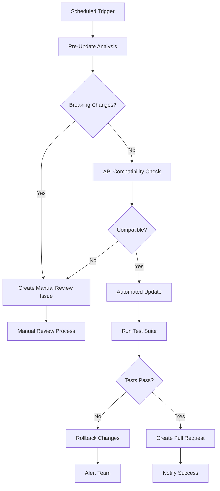

# Dependency Management Best Practices

## Overview

This document outlines the comprehensive dependency management strategy for the TradingAgents framework, including automated update procedures, security policies, and best practices for maintaining a secure and stable codebase.

## Table of Contents

- [Automated Dependency Management](#automated-dependency-management)
- [Security Policies](#security-policies)
- [Breaking Change Management](#breaking-change-management)
- [API Compatibility Validation](#api-compatibility-validation)
- [Maintenance Procedures](#maintenance-procedures)
- [Emergency Response](#emergency-response)
- [Best Practices](#best-practices)

## Automated Dependency Management

### Update Schedule

Our automated dependency management follows a structured schedule:

#### Daily Tasks (06:00 UTC)
- **Security Vulnerability Scanning**: Automated scan for new security vulnerabilities
- **Critical Security Updates**: Immediate application of critical security patches
- **Health Monitoring**: System health checks and dependency status monitoring

#### Weekly Tasks (Sundays, 02:00 UTC)
- **Minor Updates**: Automated minor version updates for all services
- **Compatibility Testing**: API compatibility validation for updated packages
- **Integration Testing**: Full test suite execution after updates

#### Monthly Tasks (First Sunday, 01:00 UTC)
- **Major Update Analysis**: Breaking change detection for major version updates
- **Maintenance Report**: Comprehensive dependency health report
- **Manual Review Planning**: Identification of packages requiring manual intervention

### Automation Workflow



### Services Covered

- **trading-agents**: Main application service
- **reddit-service**: Social sentiment analysis
- **yahoo-finance-service**: Financial data provider
- **google-news-service**: News aggregation
- **finance-aggregator-service**: Multi-provider data aggregation

## Security Policies

### Vulnerability Response

#### Critical Vulnerabilities (CVSS 9.0-10.0)
- **Response Time**: Immediate (within 4 hours)
- **Action**: Automatic emergency update
- **Notification**: Immediate Slack/email alerts
- **Testing**: Expedited testing with rollback capability

#### High Vulnerabilities (CVSS 7.0-8.9)
- **Response Time**: Within 24 hours
- **Action**: Scheduled security update
- **Notification**: Daily security report
- **Testing**: Standard test suite execution

#### Medium/Low Vulnerabilities (CVSS < 7.0)
- **Response Time**: Next scheduled maintenance window
- **Action**: Include in regular update cycle
- **Notification**: Weekly maintenance report
- **Testing**: Full regression testing

### Security Scanning Tools

1. **npm audit**: Built-in Node.js security auditing
2. **Snyk**: Third-party vulnerability scanning
3. **GitHub Security Advisories**: Automated vulnerability detection
4. **Custom Scripts**: Internal security monitoring

### Security Thresholds

```yaml
thresholds:
  critical_vulnerabilities: 0      # Zero tolerance for critical issues
  high_vulnerabilities: 5          # Maximum 5 high-severity issues
  outdated_packages_warning: 10    # Warning at 10 outdated packages
  outdated_packages_critical: 25   # Critical at 25 outdated packages
  days_since_last_update: 30       # Maximum 30 days without updates
```

## Breaking Change Management

### Detection Strategy

Our breaking change detection system analyzes:

1. **Major Version Updates**: Semantic versioning major version changes
2. **API Signature Changes**: Method signature modifications
3. **Deprecated Feature Removal**: Removal of deprecated functionality
4. **Configuration Changes**: Breaking configuration format changes

### Known Breaking Changes Database

We maintain a comprehensive database of known breaking changes for critical packages:

#### Winston (Logging Framework)
- **v3.0.0**: Logger.log() signature changed, transport configuration format updated
- **v3.18.0**: New logging API methods, deprecated method warnings

#### Express (Web Framework)
- **v5.0.0**: Middleware signature changes, router behavior modifications

#### Zep.js (Memory System)
- **v2.0.0**: Client initialization API changed, memory API methods renamed

#### LangChain/LangGraph (AI Framework)
- **v0.3.0+**: Provider abstraction changes, chain interface updates
- **v0.6.0+**: Graph definition API changes, node execution model updates

### Breaking Change Response Process

1. **Detection**: Automated scanning identifies potential breaking changes
2. **Analysis**: Detailed impact assessment and migration planning
3. **Documentation**: Creation of migration guides and code examples
4. **Testing**: Comprehensive testing of affected components
5. **Implementation**: Staged rollout with rollback capability
6. **Validation**: Post-update verification and monitoring

## API Compatibility Validation

### Pre-Update Testing

Before any dependency update, we perform comprehensive API compatibility testing:

#### Test Categories

1. **Core API Tests**: Basic functionality and method availability
2. **Integration Tests**: Service-to-service communication validation
3. **Configuration Tests**: Configuration format and option validation
4. **Error Handling Tests**: Error response and exception handling

#### Validation Process

```typescript
// Example API compatibility test structure
interface APICompatibilityTest {
  package: string;
  testScript: string;
  expectedOutput: string[];
  criticalAPIs: string[];
  errorPatterns: string[];
}
```

#### Compatibility Criteria

- **Compatible**: All tests pass, no breaking changes detected
- **Warning**: Tests pass but deprecation warnings present
- **Incompatible**: Tests fail or critical APIs unavailable

### Post-Update Validation

After successful updates:

1. **Smoke Tests**: Basic functionality verification
2. **Integration Tests**: End-to-end workflow testing
3. **Performance Tests**: Performance regression detection
4. **Security Tests**: Security posture validation

## Maintenance Procedures

### Regular Maintenance Tasks

#### Daily Maintenance
```bash
# Security vulnerability scan
./scripts/dependency-monitor.ps1 -Service all

# Health status check
./scripts/dependency-maintenance-scheduler.ps1 -Action status
```

#### Weekly Maintenance
```bash
# Minor dependency updates
./scripts/dependency-update.ps1 -Service all

# API compatibility validation
./scripts/dependency-api-compatibility-validator.ps1 -Service all -AllPackages
```

#### Monthly Maintenance
```bash
# Breaking change analysis
./scripts/dependency-breaking-change-detector.ps1 -Service all -AllPackages

# Comprehensive maintenance report
./scripts/dependency-maintenance-scheduler.ps1 -Action report
```

### Manual Maintenance Procedures

#### Major Version Updates

1. **Pre-Update Analysis**
   ```bash
   # Analyze breaking changes
   ./scripts/dependency-breaking-change-detector.ps1 -Package "winston" -FromVersion "3.0.0" -ToVersion "3.18.0"
   
   # Test API compatibility
   ./scripts/dependency-api-compatibility-validator.ps1 -Package "winston" -Version "3.18.0"
   ```

2. **Staged Update Process**
   ```bash
   # Create backup
   ./scripts/dependency-update.ps1 -Service trading-agents -DryRun
   
   # Perform update with testing
   ./scripts/dependency-update.ps1 -Service trading-agents -Major
   ```

3. **Post-Update Validation**
   ```bash
   # Run comprehensive tests
   cd services/trading-agents
   npm run quality
   npm test
   npm run smoke
   ```

#### Emergency Security Updates

1. **Immediate Response**
   ```bash
   # Emergency security update
   ./scripts/dependency-update.ps1 -Service all -Security
   ```

2. **Rapid Testing**
   ```bash
   # Quick validation
   ./scripts/dependency-api-compatibility-validator.ps1 -Service all -AllPackages
   ```

3. **Deployment**
   ```bash
   # Deploy with monitoring
   docker-compose up -d --build
   ```

### Rollback Procedures

#### Automatic Rollback Triggers
- Test suite failures
- API compatibility failures
- Security audit failures
- Performance regression detection

#### Manual Rollback Process
```bash
# List available backups
ls backups/dependency-updates/

# Rollback to specific backup
./scripts/dependency-rollback.ps1 -BackupPath "backups/dependency-updates/trading-agents-20241210-143022"
```

## Emergency Response

### Critical Vulnerability Response

#### Immediate Actions (0-4 hours)
1. **Assessment**: Evaluate vulnerability impact and affected services
2. **Isolation**: Isolate affected services if necessary
3. **Patching**: Apply emergency security patches
4. **Testing**: Rapid compatibility and functionality testing
5. **Deployment**: Emergency deployment with monitoring

#### Short-term Actions (4-24 hours)
1. **Comprehensive Testing**: Full test suite execution
2. **Security Validation**: Complete security audit
3. **Documentation**: Update security documentation
4. **Communication**: Stakeholder notification and reporting

#### Long-term Actions (1-7 days)
1. **Root Cause Analysis**: Investigate vulnerability source
2. **Process Improvement**: Update detection and response procedures
3. **Training**: Team training on new security measures
4. **Monitoring**: Enhanced monitoring implementation

### Communication Protocols

#### Notification Channels
- **Slack**: Real-time team notifications
- **Email**: Formal stakeholder communication
- **GitHub Issues**: Technical tracking and documentation
- **Status Page**: Public status updates (if applicable)

#### Escalation Matrix
1. **Level 1**: Development team notification
2. **Level 2**: Technical lead and security team
3. **Level 3**: Management and stakeholder notification
4. **Level 4**: External communication and public disclosure

## Best Practices

### Development Practices

#### Dependency Selection
1. **Security First**: Choose packages with strong security track records
2. **Active Maintenance**: Prefer actively maintained packages
3. **Minimal Dependencies**: Avoid packages with excessive transitive dependencies
4. **License Compatibility**: Ensure license compatibility with project requirements

#### Version Management
1. **Semantic Versioning**: Follow semantic versioning principles
2. **Version Pinning**: Pin exact versions for production dependencies
3. **Range Specifications**: Use appropriate version ranges for development
4. **Lock Files**: Commit package-lock.json for reproducible builds

#### Testing Strategy
1. **Automated Testing**: Comprehensive automated test coverage
2. **Dependency Testing**: Specific tests for dependency integrations
3. **Regression Testing**: Automated regression test execution
4. **Performance Testing**: Monitor performance impact of updates

### Security Practices

#### Vulnerability Management
1. **Regular Scanning**: Daily vulnerability scanning
2. **Immediate Response**: Rapid response to critical vulnerabilities
3. **Patch Management**: Systematic patch application process
4. **Audit Trail**: Maintain complete audit trail of security actions

#### Access Control
1. **Principle of Least Privilege**: Minimal necessary permissions
2. **Multi-Factor Authentication**: MFA for all administrative access
3. **Regular Access Review**: Periodic access permission review
4. **Secure Storage**: Secure storage of credentials and secrets

### Monitoring and Alerting

#### Key Metrics
- Vulnerability count by severity
- Package freshness (days since last update)
- Test suite success rate
- Deployment frequency and success rate
- Mean time to recovery (MTTR)

#### Alert Thresholds
- **Critical**: Any critical vulnerability detected
- **High**: More than 5 high-severity vulnerabilities
- **Warning**: More than 10 outdated packages
- **Info**: Successful automated updates

### Documentation Standards

#### Required Documentation
1. **Change Logs**: Detailed change documentation
2. **Migration Guides**: Step-by-step migration instructions
3. **Security Advisories**: Security-related change documentation
4. **Testing Reports**: Comprehensive testing result documentation

#### Documentation Maintenance
1. **Regular Updates**: Keep documentation current with changes
2. **Version Control**: Track documentation changes in version control
3. **Review Process**: Regular documentation review and validation
4. **Accessibility**: Ensure documentation is easily accessible to team

## Tools and Scripts

### Automation Scripts

| Script | Purpose | Frequency |
|--------|---------|-----------|
| `dependency-monitor.ps1` | Vulnerability scanning and monitoring | Daily |
| `dependency-update.ps1` | Automated dependency updates | Weekly |
| `dependency-rollback.ps1` | Emergency rollback capability | As needed |
| `dependency-breaking-change-detector.ps1` | Breaking change analysis | Before major updates |
| `dependency-api-compatibility-validator.ps1` | API compatibility testing | Before updates |
| `dependency-maintenance-scheduler.ps1` | Maintenance task coordination | Daily/Weekly/Monthly |

### GitHub Workflows

| Workflow | Purpose | Trigger |
|----------|---------|---------|
| `dependency-monitor.yml` | Daily vulnerability monitoring | Schedule + Manual |
| `dependency-update-automation.yml` | Automated update process | Schedule + Manual |
| `ci-cd.yml` | Continuous integration and deployment | Push + PR |

### Monitoring Tools

- **npm audit**: Built-in security auditing
- **Snyk**: Third-party vulnerability scanning
- **GitHub Security Advisories**: Automated vulnerability alerts
- **Custom monitoring**: Internal health and status monitoring

## Compliance and Governance

### Compliance Requirements
- Regular security audits and vulnerability assessments
- Documentation of all dependency changes
- Approval process for major version updates
- Incident response and communication procedures

### Governance Structure
- **Security Team**: Overall security policy and incident response
- **Development Team**: Day-to-day dependency management
- **Technical Lead**: Major update approval and technical decisions
- **Management**: Strategic decisions and resource allocation

### Audit and Reporting
- Monthly dependency health reports
- Quarterly security assessment reports
- Annual dependency management process review
- Incident post-mortem reports and lessons learned

---

## Quick Reference

### Emergency Contacts
- **Security Team**: security@company.com
- **Technical Lead**: tech-lead@company.com
- **On-Call Engineer**: +1-XXX-XXX-XXXX

### Key Commands
```bash
# Check status
./scripts/dependency-maintenance-scheduler.ps1 -Action status

# Emergency security update
./scripts/dependency-update.ps1 -Service all -Security

# Rollback changes
./scripts/dependency-rollback.ps1 -BackupPath [backup-path]

# Generate report
./scripts/dependency-maintenance-scheduler.ps1 -Action report
```

### Important Links
- [GitHub Security Advisories](https://github.com/advisories)
- [npm Security Advisories](https://www.npmjs.com/advisories)
- [Snyk Vulnerability Database](https://snyk.io/vuln/)
- [NIST National Vulnerability Database](https://nvd.nist.gov/)

---

*This document is maintained by the TradingAgents development team and is updated regularly to reflect current best practices and procedures.*