# 🏗️ TradingAgents System Architecture

## Overview

The TradingAgents framework is a comprehensive multi-agent LLM trading system built with TypeScript, featuring advanced memory systems, real-time data integration, and sophisticated agent orchestration.

```mermaid
graph TB
    %% User Interface Layer
    subgraph "User Interface Layer"
        CLI[Interactive CLI<br/>main.ts]
        Web[Web Dashboard<br/>Future Enhancement]
    end

    %% Core Orchestration Layer
    subgraph "Core Orchestration Layer"
        ETG[Enhanced Trading Graph<br/>enhanced-trading-graph.ts]
        LG[LangGraph Setup<br/>langgraph-working.ts]
        LSM[Lazy State Manager<br/>lazy-factory.ts]
        OSM[Optimized State Manager<br/>state-optimization.ts]
    end

    %% Agent Layer
    subgraph "Agent Layer"
        subgraph "Analyst Agents"
            MA[Market Analyst<br/>learning-market-analyst.ts]
            SA[Social Analyst<br/>social-analyst.ts]
            NA[News Analyst<br/>news-analyst.ts]
            FA[Fundamentals Analyst<br/>fundamentals-analyst.ts]
        end

        subgraph "Research Agents"
            BR[Bull Researcher<br/>bull-researcher.ts]
            BER[Bear Researcher<br/>bear-researcher.ts]
            RM[Research Manager<br/>research-manager.ts]
        end

        subgraph "Risk Management"
            PM[Portfolio Manager<br/>portfolio-manager.ts]
            RA[Risky Analyst<br/>risky-analyst.ts]
            SFA[Safe Analyst<br/>safe-analyst.ts]
            NA2[Neutral Analyst<br/>neutral-analyst.ts]
        end

        subgraph "Execution"
            TR[Trader Agent<br/>trader.ts]
        end
    end

    %% Learning & Memory Layer
    subgraph "Learning & Memory Layer"
        subgraph "Advanced Memory System"
            PLL[Performance Learning Layer<br/>performance-learning-layer.ts]
            CRL[Context Retrieval Layer<br/>context-retrieval-layer.ts]
            MCL[Memory Consolidation Layer<br/>memory-consolidation-layer.ts]
            TRL[Temporal Relationship Layer<br/>temporal-relationship-mapper.ts]
        end

        subgraph "Memory Components"
            CSM[Cross-Session Memory<br/>cross-session-memory.ts]
            PR[Pattern Recognition<br/>pattern-recognition.ts]
            TR[Temporal Reasoning<br/>temporal-reasoning.ts]
        end

        subgraph "Learning Agents"
            LAB[Learning Agent Base<br/>learning-agent.ts]
            LMA[Learning Market Analyst<br/>learning-market-analyst.ts]
        end
    end

    %% Data Integration Layer
    subgraph "Data Integration Layer"
        subgraph "Market Data Providers"
            YF[Yahoo Finance<br/>yahoo-finance.ts]
            AV[Alpha Vantage<br/>alpha-vantage.ts]
            MS[MarketStack<br/>marketstack.ts]
            FH[FinnHub<br/>finnhub.ts]
        end

        subgraph "News & Social Data"
            GN[Google News<br/>google-news.ts]
            RD[Reddit API<br/>reddit.ts]
            OD[OpenAI Data<br/>openai-data.ts]
        end

        subgraph "Technical Analysis"
            TI[Technical Indicators<br/>technical-indicators.ts]
            UMD[Unified Market Data<br/>unified-market-data.ts]
            CD[Cached Dataflows<br/>cached-dataflows.ts]
        end
    end

    %% Infrastructure Layer
    subgraph "Infrastructure Layer"
        subgraph "Container Services"
            NEO4J[(Neo4j Database<br/>bolt://localhost:7687)]
            ZEP[Zep Graphiti Service<br/>http://localhost:8000]
            REDDIT[Reddit Service<br/>http://localhost:3001<br/>Feature-Flagged]
            NEWS[News Aggregator<br/>http://localhost:3004]
        end

        subgraph "LLM Providers"
            LMST[LM Studio<br/>Singleton Pattern]
            OPENAI[OpenAI API<br/>GPT-4, GPT-3.5]
            ANTHROPIC[Anthropic Claude<br/>Future Support]
        end

        subgraph "External APIs"
            YAHOO[Yahoo Finance API]
            ALPHA[Alpha Vantage API]
            MARKET[MarketStack API]
            FINNHUB[FinnHub API]
            GOOGLE[Google News API]
            REDDIT_API[Reddit API]
        end
    end

    %% Utility Layer
    subgraph "Utility Layer"
        LOGGER[Enhanced Logger<br/>Winston + Trace Correlation]
        CONFIG[Configuration Manager<br/>config-manager.ts]
        CACHE[Caching System<br/>LRU + TTL]
        HEALTH[Health Monitor<br/>health-monitor.ts]
        EXPORT[Export Manager<br/>export-manager.ts]
    end

    %% Flow Connections
    CLI --> ETG
    Web --> ETG

    ETG --> LG
    ETG --> LSM
    ETG --> OSM

    LG --> MA
    LG --> SA
    LG --> NA
    LG --> FA
    LG --> BR
    LG --> BER
    LG --> RM
    LG --> PM
    LG --> RA
    LG --> SFA
    LG --> NA2
    LG --> TR

    MA --> PLL
    MA --> CRL
    MA --> CSM
    MA --> PR
    MA --> TR

    PLL --> LAB
    CRL --> LAB
    MCL --> LAB
    TRL --> LAB

    LAB --> LMA

    MA --> YF
    SA --> RD
    NA --> GN
    FA --> YF
    FA --> AV
    FA --> MS

    YF --> TI
    AV --> TI
    MS --> TI
    FH --> TI

    TI --> UMD
    UMD --> CD

    MA --> ZEP
    SA --> ZEP
    NA --> ZEP
    FA --> ZEP

    ZEP --> NEO4J

    MA --> LMST
    SA --> LMST
    NA --> LMST
    FA --> LMST
    BR --> LMST
    BER --> LMST
    RM --> LMST
    PM --> LMST
    RA --> LMST
    SFA --> LMST
    NA2 --> LMST
    TR --> LMST

    LMST --> OPENAI
    LMST --> ANTHROPIC

    YF --> YAHOO
    AV --> ALPHA
    MS --> MARKET
    FH --> FINNHUB
    GN --> GOOGLE
    RD --> REDDIT_API

    ETG --> LOGGER
    CLI --> CONFIG
    CLI --> CACHE
    CLI --> HEALTH
    CLI --> EXPORT

    %% Styling
    classDef userInterface fill:#e1f5fe,stroke:#01579b,stroke-width:2px
    classDef orchestration fill:#f3e5f5,stroke:#4a148c,stroke-width:2px
    classDef agents fill:#e8f5e8,stroke:#1b5e20,stroke-width:2px
    classDef learning fill:#fff3e0,stroke:#e65100,stroke-width:2px
    classDef data fill:#fce4ec,stroke:#880e4f,stroke-width:2px
    classDef infrastructure fill:#f5f5f5,stroke:#424242,stroke-width:2px
    classDef utilities fill:#e0f2f1,stroke:#004d40,stroke-width:2px

    class CLI,Web userInterface
    class ETG,LG,LSM,OSM orchestration
    class MA,SA,NA,FA,BR,BER,RM,PM,RA,SFA,NA2,TR agents
    class PLL,CRL,MCL,TRL,CSM,PR,TR,LAB,LMA learning
    class YF,AV,MS,FH,GN,RD,OD,TI,UMD,CD data
    class NEO4J,ZEP,REDDIT,NEWS,LMST,OPENAI,ANTHROPIC,YAHOO,ALPHA,MARKET,FINNHUB,GOOGLE,REDDIT_API infrastructure
    class LOGGER,CONFIG,CACHE,HEALTH,EXPORT utilities
```



## Architecture Components

### 🎯 **User Interface Layer**
- **Interactive CLI**: Primary user interface for running analyses
- **Web Dashboard**: Future enhancement for web-based monitoring

### 🧠 **Core Orchestration Layer**
- **Enhanced Trading Graph**: Main orchestrator combining LangGraph and lazy loading
- **LangGraph Setup**: Advanced agent workflow management
- **Lazy State Manager**: Performance optimization through on-demand loading
- **Optimized State Manager**: Memory-efficient state management

### 🤖 **Agent Layer**
- **Analyst Agents**: Market, Social, News, Fundamentals analysis
- **Research Agents**: Bull/Bear case analysis and research management
- **Risk Management**: Portfolio management and risk assessment
- **Execution**: Trading strategy execution

### 🧠 **Learning & Memory Layer**
- **Advanced Memory System**: Performance learning, context retrieval, memory consolidation
- **Memory Components**: Cross-session memory, pattern recognition, temporal reasoning
- **Learning Agents**: Base learning functionality and specialized learning market analyst

### 📊 **Data Integration Layer**
- **Market Data Providers**: Yahoo Finance, Alpha Vantage, MarketStack, FinnHub
- **News & Social Data**: Google News, Reddit API, OpenAI data integration
- **Technical Analysis**: Comprehensive technical indicators and unified market data

### 🏗️ **Infrastructure Layer**
- **Container Services**: Neo4j, Zep Graphiti, Reddit Service, News Aggregator
- **LLM Providers**: LM Studio (singleton), OpenAI, Anthropic
- **External APIs**: All third-party data provider APIs

### 🔧 **Utility Layer**
- **Enhanced Logger**: Winston-based logging with trace correlation
- **Configuration Manager**: Centralized configuration management
- **Caching System**: LRU cache with TTL for performance
- **Health Monitor**: Comprehensive system health monitoring
- **Export Manager**: Results export and reporting

## Data Flow

```
User Input → CLI → Enhanced Trading Graph → LangGraph → Agents → Data Providers → Memory System → Results
```

## Key Features

### 🚀 **Performance Optimizations**
- Lazy loading for reduced memory footprint
- Intelligent caching with LRU and TTL
- Optimized state management
- Parallel agent execution

### 🧠 **Advanced Learning**
- Supervised, unsupervised, and reinforcement learning
- Pattern recognition and temporal reasoning
- Performance learning with feature importance
- Cross-session memory and insight accumulation

### 🔒 **Enterprise Security**
- Environment variable configuration
- Docker secrets management
- Network isolation
- Health monitoring and alerting

### 📈 **Scalability**
- Containerized architecture
- Horizontal scaling support
- Resource optimization
- Performance monitoring

## Technology Stack

- **Frontend**: TypeScript, Node.js, Inquirer.js
- **Backend**: TypeScript, LangGraph, LangChain
- **Database**: Neo4j (graph database)
- **Memory**: Zep Graphiti (knowledge graphs)
- **Containerization**: Docker, Docker Compose
- **LLM**: LM Studio, OpenAI, Anthropic
- **Data Sources**: Yahoo Finance, Alpha Vantage, MarketStack, Google News, Reddit
- **Logging**: Winston with structured logging
- **Build System**: Vite with ES modules

---

*This architecture diagram provides a comprehensive view of the TradingAgents system, showing the relationships between all major components and data flows.*</content>
<parameter name="filePath">c:\code\PersonalDev\my-Trading-Agents\docs\SYSTEM-ARCHITECTURE.md