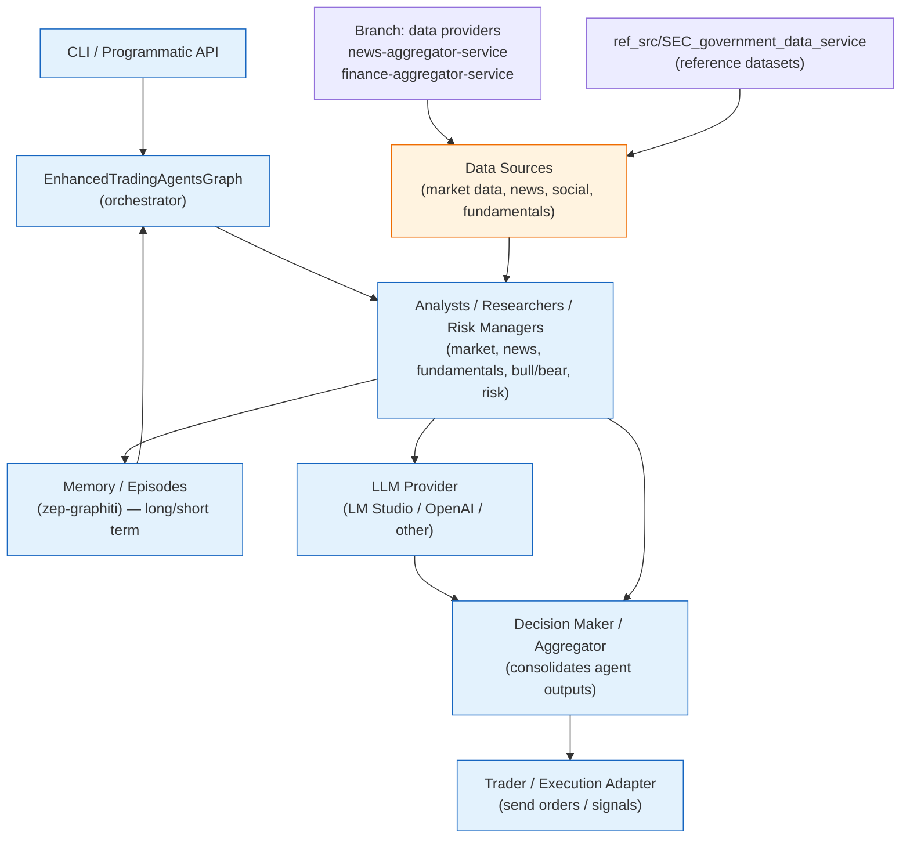

# js (TypeScript) — TradingAgents CLI and Services

This folder contains the TypeScript implementation of the TradingAgents framework.

## Cross-Shell + vite-node (Quick Start)

- Use `npm run` scripts for portability across bash/cmd/PowerShell.
- Chaining: `&&` works in bash/cmd and PowerShell 7+; on older PowerShell use `;` or separate lines.
- Run TS/ESM directly with vite-node (shell-agnostic): `npx vite-node <file>`.

Examples (any shell):
```
cd js
npm install
npm run build && npm test         # bash/cmd/PowerShell 7+
# or PowerShell-compatible alternative
npm run build; if ($?) { npm test }

# Run a TS test/demo with vite-node
npx vite-node tests/config/basic-config.test.ts
```

## CLI

The CLI entrypoint is `src/cli/main.ts` (built into `dist/cli/cli.js`). Use `createCLI()` to programmatically create the commander `Command` instance.

Key CLI commands:

- `analyze [ticker] [date]` — Run a full trading analysis (interactive otherwise)
- `menu` — Show interactive main menu
- `historical` — Run historical analysis workflows
- `config` — Manage saved CLI configurations

LM Studio admin helper commands:

- `lmstudio:preload -m <model> -h <host>`: Preload a model on LM Studio and poll for availability.
- `lmstudio:unload -m <model> [-a <adminUrl>]`: Request unload via the LM Studio admin endpoint. Falls back to `LM_STUDIO_ADMIN_URL` env var.
- `lmstudio:switch -t <model> -h <host> [-f <previous>] [-a <adminUrl>] [--no-unload]`: Switch an LM Studio instance to a new model and optionally unload the previous.
- `lmstudio:metrics`: Print LM Studio manager metrics snapshot.

Examples:

```powershell
# Preload model
node dist/cli/cli.js lmstudio:preload -m "llama-3.2-3b-instruct" -h "http://localhost:1234/v1"

# Unload
node dist/cli/cli.js lmstudio:unload -m "old-model" -a "http://localhost:1234/admin"

# Switch
node dist/cli/cli.js lmstudio:switch -t "llama-3.2-3b-instruct" -h "http://localhost:1234/v1" -f "old-model" -a "http://localhost:1234/admin"

# Metrics
node dist/cli/cli.js lmstudio:metrics
```

## ModelProvider

The `ModelProvider` in `src/models/provider.ts` implements a generic factory pattern for creating and caching LLM instances. It is intentionally provider-agnostic so additional providers can be added later without changing the public surface used by agents. LM Studio-specific behavior is implemented as a wrapper that ensures the requested model is loaded before invocation — this is an implementation detail and does not fence other providers.

When writing agents, do not assume LM Studio is the only provider; instead use `ModelConfig` and `createModelAsync`/`createAgentModels` to obtain model instances for each agent.

Troubleshooting

- Admin endpoint not responding:
	- Verify `LM_STUDIO_ADMIN_URL` or pass `-a` to the CLI command. Ensure ports are mapped and accessible.
- Model doesn't appear after preload:
	- Inspect LM Studio `/models` endpoint and logs. Consider increasing `LM_STUDIO_MODEL_CACHE_TTL_MS`.
- CLI exit codes and errors:
	- The CLI will print a helpful error and return a non-zero exit code on failure. Check LM Studio admin logs and network settings.

Design note: The `ModelProvider` is intentionally generic. Do not hardcode provider-specific logic into agent code — keep provider-specific behaviors inside `src/models/provider.ts` and supporting managers (like `lmstudio-manager.ts`).

## Tests

Test files live in `services/trading-agents/tests/`. Use the project's npm scripts to run tests:

```powershell
cd js
npm install
npm test
```

### Risk Management Testing

Comprehensive risk management unit tests validate all core risk calculation functions:

- **Technical Risk Assessment**: RSI, MACD, Bollinger Band analysis
- **Quantitative Models**: VaR, CVaR, Monte Carlo simulation  
- **Sector Sentiment**: Real news integration with sentiment analysis
- **Volatility Analysis**: GARCH modeling, ARCH tests, clustering detection
- **Portfolio Risk**: Multi-asset risk calculations and stress testing
- **Extreme Scenarios**: Market crashes, sector crises, black swan events

**Performance Requirements Met**:
- Individual assessments: < 500ms average
- Comprehensive analysis: < 2 seconds average
- Large portfolios (50 assets): < 5 seconds
- Stress scenarios: < 30 seconds for 10 extreme scenarios

Run risk management tests specifically:
```powershell
npm test -- --testPathPattern="risk-management.*test"
```

Admin endpoint diagnostics

If you are having trouble with LM Studio admin commands (load/unload/switch), the following quick checks can help:

- Verify admin URL and base URL:

```powershell
# Check models list on the LM Studio base URL
curl http://localhost:1234/v1/models

# Check admin load/unload endpoints (POST a test payload)
curl -X POST http://localhost:1234/admin/models/load -H "Content-Type: application/json" -d '{"model":"test-model"}'

# Check admin health (if provided)
curl http://localhost:1234/admin/health
```

- Use verbose networking to inspect failures (PowerShell example):

```powershell
# Re-run CLI with verbose logging to see detailed network calls
node dist/cli/cli.js --verbose lmstudio:preload -m "test-model" -h "http://localhost:1234/v1"
```

- If using Docker, ensure ports are mapped and containers are healthy:

```powershell
docker ps --filter "name=lm_studio" --filter "status=running"
docker logs <lm_studio_container_id>
```

Notes:
- The admin endpoints are typically container-specific and can be behind reverse proxies; double-check the exact path and port used by your LM Studio build.
- If LM Studio is behind authentication, ensure CLI calls include the required auth headers by setting environment variables or updating `LMStudioManager` to include authentication headers.

## Runtime workflow (focus)

The diagram below shows the runtime, high-level workflow the TradingAgents system follows during an analysis run — this focuses on the interesting runtime pieces (CLI/orchestrator, agents, memory, LLM, decision and trader) and omits infra/tools details.



Notes:
- The orchestrator (EnhancedTradingAgentsGraph) coordinates parallel analyst agents, collects their outputs, and records episodes to memory.
- Analysts may call the LLM for reasoning or summarization and also read/write memory episodes; memory supports search and retrieval across past episodes.
- The Decision Maker aggregates analyst outputs (structured summaries + confidences) into a single recommendation the Trader can act upon.
- The Decision Maker aggregates analyst outputs (structured summaries + confidences) into a single recommendation the Trader can act upon.
- Data sources feed the analysts (market ticks, news articles, social streams, fundamentals). The branch adds local data providers (`news-aggregator-service`, `finance-aggregator-service`) and reference datasets in `ref_src/` which are treated as additional data sources during analysis runs.

